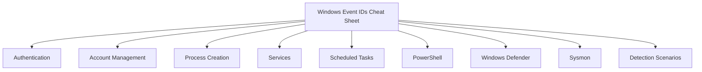

# Windows Security Event IDs Cheat Sheet

> Windows Security Event IDs explained for SOC Analysts, Blue Teamers, Threat Hunters, Incident Responders, DFIR professionals, and cybersecurity students.


---

## Overview

Windows Security Event Logs are one of the most valuable sources of forensic and security information on Windows systems.

Every authentication attempt, account modification, privilege change, process execution, and security policy modification generates specific Event IDs. Understanding these logs enables defenders to detect malicious activity, investigate incidents, and monitor system health.

This repository serves as a practical reference for commonly encountered Windows Event IDs with explanations, investigation guidance, detection ideas, and MITRE ATT&CK mappings.

---

## Who is this repository for?

- SOC Analysts
- Blue Team Engineers
- Incident Responders
- Threat Hunters
- DFIR Professionals
- Security Engineers
- Students learning Windows Security

---


## Repository Contents

| Section | Description |
|----------|-------------|
| Authentication | User logons, failed logons, special logons |
| Account Management | User creation, deletion, password changes |
| Process Creation | New process execution events |
| Services | Service installation and modification |
| Scheduled Tasks | Task creation and modification |
| PowerShell | Script block logging and execution |
| Windows Defender | Defender detections and configuration changes |
| Sysmon | Advanced endpoint telemetry |
| Detection Scenarios | Real-world attack examples |
| MITRE ATT&CK Mapping | Event IDs mapped to ATT&CK techniques |

---
## 📚 Documentation

| Topic | Link |
|-------|------|
| Authentication Events | [View](docs/authentication.md) |
| Account Management | [View](docs/account-management.md) |
| Process Creation | [View](docs/process-creation.md) |
| PowerShell Events | [View](docs/powershell.md) |
| Services | [View](docs/services.md) |
| Scheduled Tasks | [View](docs/scheduled-tasks.md) |
| Audit Events | [View](docs/audit-events.md) |
| Windows Defender | [View](docs/windows-defender.md) |
| Sysmon | [View](docs/sysmon.md) |
| Event Log Locations | [View](docs/event-log-locations.md) |
| MITRE ATT&CK Mapping | [View](docs/mitre-mapping.md) |
| Detection Scenarios | [View](docs/detection-scenarios.md) |

## Why Event IDs Matter

Windows Event Logs help defenders answer important questions:

- Who logged into the system?
- When did they log in?
- Was the login successful?
- Was a new administrator created?
- Which process started PowerShell?
- Was the audit log cleared?
- Was malware detected?
- Were new services installed?
- Was persistence established?

Without understanding Event IDs, investigating security incidents becomes significantly more difficult.

---

## Common Security Log Locations

| Log | Purpose |
|------|----------|
| Security | Authentication, privilege use, account management |
| System | Operating system and driver events |
| Application | Application-generated events |
| Setup | Windows installation events |
| Forwarded Events | Centralized log collection |
| Microsoft-Windows-Sysmon/Operational | Sysmon telemetry |

---

## Quick Reference

| Event ID | Description | Importance |
|----------|-------------|------------|
| 4624 | Successful Logon | High |
| 4625 | Failed Logon | High |
| 4634 | Logoff | Medium |
| 4672 | Special Privileges Assigned | High |
| 4688 | Process Creation | Critical |
| 4720 | User Account Created | High |
| 4726 | User Account Deleted | High |
| 4732 | User Added to Security Group | High |
| 4697 | Service Installed | Critical |
| 4698 | Scheduled Task Created | High |
| 1102 | Audit Log Cleared | Critical |

---

## Investigation Workflow

```text
Alert Generated
      │
      ▼
Identify Event ID
      │
      ▼
Review User Account
      │
      ▼
Review Source IP
      │
      ▼
Review Process Tree
      │
      ▼
Review Parent Process
      │
      ▼
Correlate Related Event IDs
      │
      ▼
Map to MITRE ATT&CK
      │
      ▼
Contain or Escalate
```

---

## MITRE ATT&CK Examples

| Event ID | ATT&CK Technique |
|----------|------------------|
| 4625 | T1110 – Brute Force |
| 4688 | T1059 – Command and Scripting Interpreter |
| 4720 | T1136 – Create Account |
| 4697 | T1543 – Create or Modify System Process |
| 1102 | T1070 – Indicator Removal on Host |

---

## Learning Path

If you're new to Windows Security Logs, read the repository in this order:

1. Authentication Events
2. Account Management
3. Process Creation
4. Services
5. Scheduled Tasks
6. PowerShell
7. Windows Defender
8. Sysmon
9. Detection Scenarios
10. MITRE ATT&CK Mapping

---

## Contributing

Contributions are welcome.

If you know an Event ID that should be included, feel free to open an Issue or submit a Pull Request.

---

## Disclaimer

This repository is intended for educational and defensive cybersecurity purposes only.
