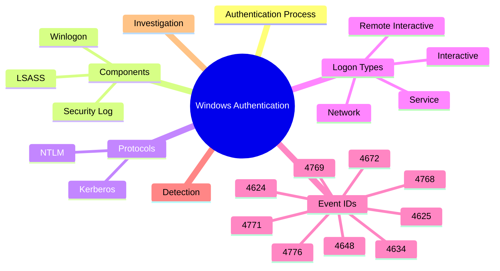
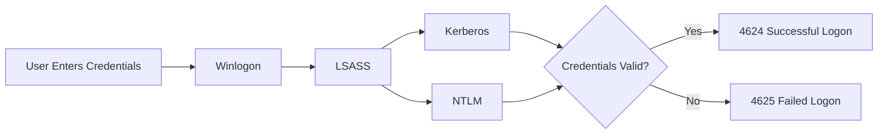
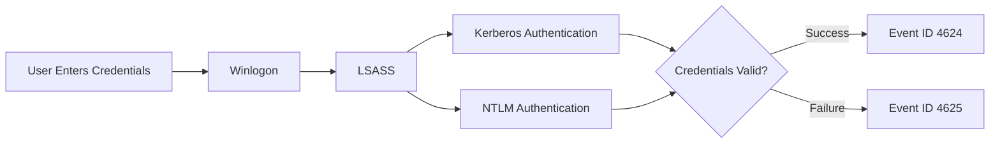
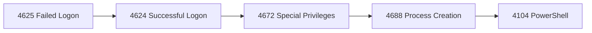
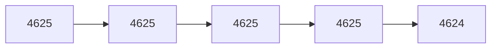
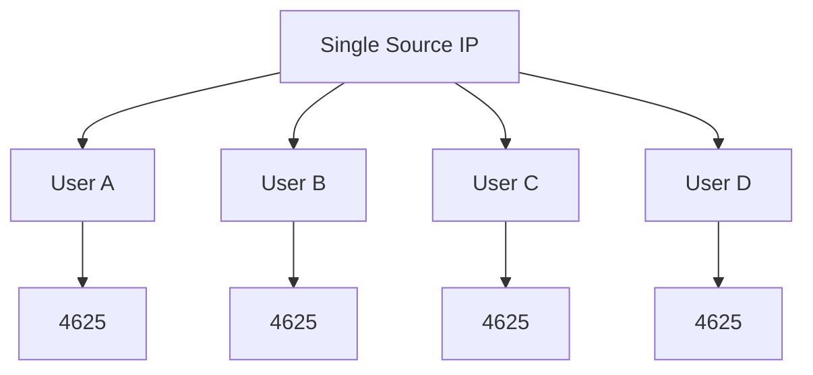
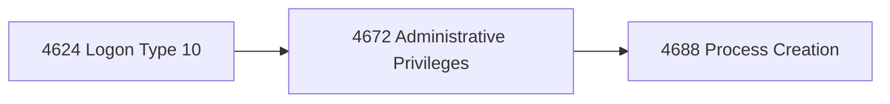
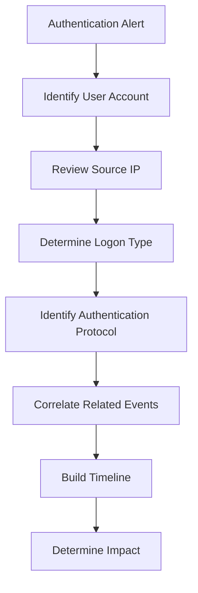

# Authentication Events


> Learn how Windows authentication events are generated, what they mean, and how security analysts use them to detect brute-force attacks, credential theft, lateral movement, privilege escalation, and unauthorized access.

---

# Introduction

> [!IMPORTANT]
> Authentication events are the foundation of Windows security monitoring. Most attack investigations begin by determining **who authenticated, from where, how, and whether the authentication was successful**.

Authentication is the process of verifying the identity of a **user**, **computer**, or **service** before granting access to Windows resources. Every authentication attempt generates one or more Windows Security Events that help defenders monitor access, investigate incidents, and detect malicious activity.

Authentication logs answer questions such as:

- Who logged in?
- When did they log in?
- Was authentication successful?
- Which account was used?
- Where did the authentication originate?
- Which protocol authenticated the user?
- Was privileged access granted?
- What happened immediately afterward?

---

## Who Should Read This?

This guide is intended for:

- SOC Analysts
- Blue Team Engineers
- Threat Hunters
- Incident Responders
- DFIR Analysts
- Windows Administrators
- Cybersecurity Students

---

## Learning Objectives

After completing this section, you will understand:

- Windows authentication architecture
- The role of LSASS
- Kerberos and NTLM
- Windows Logon Types
- Important Windows Authentication Event IDs
- Common attack scenarios
- Authentication investigation workflow

---



---

# Table of Contents

- [Introduction](#introduction)
- [Who Should Read This?](#who-should-read-this)
- [Learning Objectives](#learning-objectives)
- [What Are Authentication Events?](#what-are-authentication-events)
- [Windows Authentication Architecture](#windows-authentication-architecture)
- [Windows Authentication Components](#windows-authentication-components)
- [LSASS (Local Security Authority Subsystem Service)](#lsass-local-security-authority-subsystem-service)
- [Kerberos vs NTLM](#kerberos-vs-ntlm)
- [Windows Logon Types](#windows-logon-types)
- [Authentication Attack Timeline](#authentication-attack-timeline)
- [Common Authentication Event IDs](#common-authentication-event-ids)
- [Why Authentication Logs Matter](#why-authentication-logs-matter)
- [Authentication Attack Scenarios](#authentication-attack-scenarios)
- [Investigation Workflow](#investigation-workflow)
- [MITRE ATT&CK Mapping](#mitre-attck-mapping)
- [References](#references)

---

# What Are Authentication Events?

Authentication Events are Windows Security Log entries generated whenever Windows validates credentials for a user, service account, or computer account.

These events are stored in:

```text
Windows Logs
└── Security
```

Authentication events help detect:

- Brute-force attacks
- Password spraying
- Credential stuffing
- Pass-the-Hash attacks
- Pass-the-Ticket attacks
- Unauthorized Remote Desktop access
- Lateral movement
- Compromised accounts
- Privilege abuse

---

# Windows Authentication Architecture

Windows authentication involves several components working together before access is granted.



> [!TIP]
> Authentication events rarely exist in isolation. During investigations, always correlate authentication events with privilege assignment, process creation, PowerShell, and network activity.

---

# Windows Authentication Components

Before examining individual Event IDs, it is important to understand the Windows components involved in authentication.

| Component | Purpose |
|------------|---------|
| **Winlogon** | Collects user credentials during sign-in. |
| **LSASS** | Validates credentials and enforces local security policy. |
| **Kerberos** | Primary authentication protocol in Active Directory environments. |
| **NTLM** | Legacy authentication protocol used when Kerberos cannot be used. |
| **Security Log** | Records authentication and authorization events for investigation. |

---

# LSASS (Local Security Authority Subsystem Service)

The **Local Security Authority Subsystem Service (LSASS)** is one of the most important security processes in Windows. It is responsible for validating credentials, enforcing local security policies, generating access tokens, and recording authentication-related security events.

Whenever a user signs in, Windows forwards the authentication request to LSASS. LSASS then works with the appropriate authentication package (Kerberos or NTLM) to determine whether access should be granted.

> [!IMPORTANT]
> LSASS (`lsass.exe`) is one of the most security-critical processes in Windows. Compromising LSASS may allow attackers to extract credentials, impersonate users, and move laterally throughout the environment.

## Responsibilities of LSASS

- Validate user credentials.
- Authenticate local and domain accounts.
- Process Kerberos authentication.
- Process NTLM authentication.
- Create user access tokens.
- Enforce local security policies.
- Generate Windows Security Events.
- Manage password changes.

---

## Authentication Workflow



---

## Why SOC Analysts Should Understand LSASS

Understanding LSASS helps analysts determine:

- Why an authentication succeeded or failed.
- Which protocol authenticated the account.
- Whether authentication occurred locally or remotely.
- Whether privileged access was granted.
- Which events should be correlated during investigations.

For example:

- Event ID **4625** indicates failed authentication.
- Event ID **4624** confirms successful authentication.
- Event ID **4672** indicates privileged logon.
- Event ID **4688** reveals processes started after authentication.

> [!WARNING]
> Credential dumping tools such as Mimikatz commonly target LSASS memory to extract passwords, NTLM hashes, and Kerberos tickets. Monitoring suspicious access to LSASS is a critical defensive practice.

---
# Kerberos vs NTLM

Windows primarily uses **Kerberos** and **NTLM** for authentication. Understanding the differences between these protocols helps analysts identify normal authentication behavior and detect attacks targeting authentication mechanisms.

| Feature | Kerberos | NTLM |
|----------|-----------|------|
| Primary Usage | Active Directory domains | Legacy systems and workgroups |
| Authentication | Ticket-based | Challenge-response |
| Password Sent Over Network | No | No (hash-based challenge) |
| Mutual Authentication | ✅ Yes | ❌ No |
| Performance | Faster after initial authentication | Slower |
| Security | More secure | Less secure |
| Default in Modern Domains | ✅ Yes | Backup/Fallback |

---

## Kerberos

Kerberos is Microsoft's preferred authentication protocol for Active Directory environments.

### Features

- Ticket-based authentication
- Mutual authentication
- Supports Single Sign-On (SSO)
- Strong encryption
- Reduces password exposure over the network

### Related Event IDs

| Event ID | Description |
|----------|-------------|
| **4768** | Kerberos Authentication Ticket (TGT) Requested |
| **4769** | Kerberos Service Ticket Requested |
| **4771** | Kerberos Pre-Authentication Failed |

> [!TIP]
> Kerberos is the default authentication protocol in Active Directory. Seeing NTLM used where Kerberos is expected may warrant further investigation.

> [!WARNING]
> Kerberos ticket attacks such as **Golden Ticket**, **Silver Ticket**, and **Pass-the-Ticket** can allow attackers to authenticate without knowing a user's password.

---

## NTLM

NTLM (NT LAN Manager) is a legacy authentication protocol used when Kerberos cannot be used.

### Common Scenarios

- Workgroup computers
- Local account authentication
- Legacy applications
- Older Windows environments
- Kerberos fallback scenarios

### Related Event IDs

| Event ID | Description |
|----------|-------------|
| **4776** | NTLM Credential Validation |

> [!NOTE]
> Although NTLM remains supported, Microsoft recommends using Kerberos whenever possible due to its stronger security model.

---

# Windows Logon Types

One of the most important fields in **Event ID 4624** and **Event ID 4625** is the **Logon Type**.

The Logon Type explains **how** authentication occurred and provides valuable context during investigations.

| Logon Type | Description | Typical Usage |
|------------|-------------|---------------|
| **2** | Interactive | Local keyboard sign-in |
| **3** | Network | SMB, shared folders, remote file access |
| **4** | Batch | Scheduled Tasks |
| **5** | Service | Windows Services |
| **7** | Unlock | Unlocking a workstation |
| **8** | Network Cleartext | IIS, Basic Authentication |
| **9** | New Credentials | RunAs |
| **10** | Remote Interactive | Remote Desktop (RDP) |
| **11** | Cached Interactive | Cached domain credentials |

> [!IMPORTANT]
> **Logon Types 3 and 10** are among the most frequently investigated because they often appear during lateral movement and unauthorized remote access.

> [!NOTE]
> The same Event ID may appear with different Logon Types depending on how authentication occurred.

---

# Authentication Attack Timeline

Authentication events rarely occur in isolation.



> [!TIP]
> Authentication events should always be correlated with privilege assignments, process creation events, PowerShell activity, and network connections to build a complete attack timeline.

---

# Common Authentication Event IDs

The following Event IDs form the foundation of Windows authentication investigations.

| Event ID | Description | Importance | Documentation |
|----------:|-------------|:----------:|---------------|
| **4624** | Successful Logon | ⭐⭐⭐⭐⭐ | [View](authentication/4624-successful-logon.md) |
| **4625** | Failed Logon | ⭐⭐⭐⭐⭐ | [View](authentication/4625-failed-logon.md) |
| **4634** | Logoff | ⭐⭐⭐ | [View](authentication/4634-logoff.md) |
| **4648** | Logon Using Explicit Credentials | ⭐⭐⭐⭐ | [View](authentication/4648-explicit-credentials.md) |
| **4672** | Special Privileges Assigned to New Logon | ⭐⭐⭐⭐⭐ | [View](authentication/4672-special-privileges.md) |
| **4768** | Kerberos Authentication Ticket (TGT) Requested | ⭐⭐⭐⭐ | [View](authentication/4768-kerberos-tgt.md) |
| **4769** | Kerberos Service Ticket Requested | ⭐⭐⭐⭐ | [View](authentication/4769-service-ticket.md) |
| **4771** | Kerberos Pre-Authentication Failed | ⭐⭐⭐⭐ | [View](authentication/4771-kerberos-failure.md) |
| **4776** | NTLM Credential Validation | ⭐⭐⭐⭐ | [View](authentication/4776-ntlm-authentication.md) |

---

# Why Authentication Logs Matter

Authentication events are often the **earliest indicators of malicious activity** within an environment.

| Attack Technique | Primary Event IDs |
|------------------|-------------------|
| Brute Force | 4625 |
| Password Spraying | 4625 |
| Successful Account Compromise | 4624 |
| Privilege Escalation | 4672 |
| Lateral Movement | 4624 + 4769 |
| Pass-the-Hash | 4624 + 4776 |
| Pass-the-Ticket | 4768 + 4769 |
| Unauthorized RDP Login | 4624 (Logon Type 10) |

---

# Authentication Attack Scenarios

## Scenario 1 — Brute Force

An attacker repeatedly attempts different passwords against the same account.



Indicators:

- Same username
- Same source IP
- High number of failed attempts
- Successful authentication afterward

---

## Scenario 2 — Password Spraying

An attacker attempts a single password against many user accounts.



Characteristics:

- Same source IP
- Multiple usernames
- Few attempts per account
- Designed to avoid account lockout policies

---

## Scenario 3 — Unauthorized Remote Desktop Access



Questions to ask:

- Is the source IP expected?
- Is the user normally allowed RDP access?
- Was the login performed during business hours?
- Were suspicious processes started after authentication?

---

# Investigation Workflow

When investigating suspicious authentication activity:



### Investigation Checklist

- Review the affected account.
- Determine whether authentication succeeded or failed.
- Examine the Logon Type.
- Identify the source IP address.
- Determine whether Kerberos or NTLM was used.
- Search for Event ID **4672**.
- Review Event ID **4688**.
- Examine PowerShell activity (**4104**).
- Review network connections.
- Build a complete timeline before drawing conclusions.

---

# MITRE ATT&CK Mapping

| Event ID | ATT&CK Technique | Description |
|-----------|------------------|-------------|
| **4625** | T1110 | Brute Force |
| **4624** | T1078 | Valid Accounts |
| **4768** | T1558 | Steal or Forge Kerberos Tickets |
| **4769** | T1550 | Use Alternate Authentication Material |
| **4776** | T1550.002 | Pass the Hash |

---

# References

- Microsoft Learn – https://learn.microsoft.com/windows/security/
- Windows Security Auditing Documentation – https://learn.microsoft.com/windows/security/threat-protection/auditing/
- Ultimate Windows Security – https://www.ultimatewindowssecurity.com/securitylog/
- MITRE ATT&CK – https://attack.mitre.org/
- SigmaHQ – https://github.com/SigmaHQ/sigma
- NIST SP 800-61 Rev. 2 – Computer Security Incident Handling Guide

---

# Continue Reading

Continue exploring individual Authentication Event IDs:

| Event ID | Documentation |
|----------|---------------|
| **4624** | [Successful Logon](authentication/4624-successful-logon.md) |
| **4625** | [Failed Logon](authentication/4625-failed-logon.md) |
| **4634** | [Logoff](authentication/4634-logoff.md) |
| **4648** | [Logon Using Explicit Credentials](authentication/4648-explicit-credentials.md) |
| **4672** | [Special Privileges Assigned to New Logon](authentication/4672-special-privileges.md) |
| **4768** | [Kerberos Authentication Ticket (TGT)](authentication/4768-kerberos-tgt.md) |
| **4769** | [Kerberos Service Ticket](authentication/4769-service-ticket.md) |
| **4771** | [Kerberos Pre-Authentication Failed](authentication/4771-kerberos-failure.md) |
| **4776** | [NTLM Credential Validation](authentication/4776-ntlm-authentication.md) |

Each Event ID page includes:

- Overview
- Event fields
- Investigation guidance
- Detection tips
- SIEM queries (Splunk & Microsoft Sentinel)
- Sigma rules
- MITRE ATT&CK mapping
- Related Event IDs
- References
