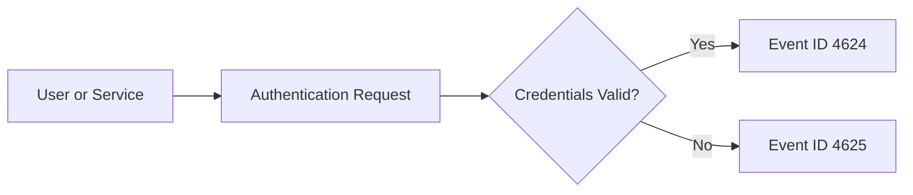
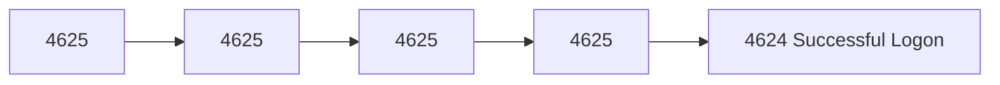
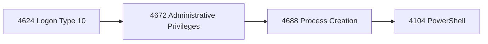
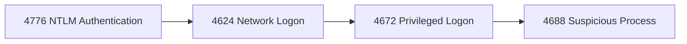
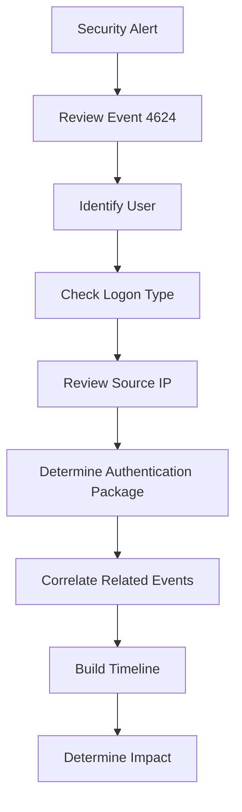
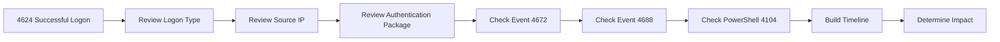

[⬅️ Authentication Overview](../authentication.md) | [➡️ Next: Event ID 4625 – Failed Logon](4625-failed-logon.md)

---

# Event ID 4624 – Successful Logon


---

## Quick Facts

| Property | Value |
|----------|-------|
| **Event ID** | 4624 |
| **Category** | Authentication |
| **Log Source** | Windows Security Log |
| **Severity** | Informational *(can indicate malicious activity depending on context)* |
| **MITRE ATT&CK** | T1078 – Valid Accounts |
| **Typical Volume** | Very High |
| **Detection Priority** | ⭐⭐⭐⭐☆ |
| **Reading Time** | ~8 minutes |

---

## Table of Contents

- [Overview](#overview)
- [Why This Event Matters](#why-this-event-matters)
- [Event Information](#event-information)
- [Common Logon Types](#common-logon-types)
- [Important Event Fields](#important-event-fields)
- [Example Event](#example-event)
- [Authentication Packages](#authentication-packages)
- [Attack Scenarios](#common-attack-scenarios)
- [Investigation Checklist](#investigation-checklist)
- [Related Event IDs](#related-event-ids)
- [Detection Tips](#detection-tips)
- [Splunk Query](#sample-splunk-query)
- [Microsoft Sentinel (KQL)](#sample-microsoft-sentinel-kql)
- [Sigma Rule](#sample-sigma-detection)
- [MITRE ATT&CK Mapping](#mitre-attck-mapping)
- [False Positives](#common-false-positives)
- [Analyst Tips](#analyst-tips)
- [References](#references)

---

# Overview

**Event ID 4624** is generated whenever Windows successfully authenticates a **user**, **computer account**, or **service account**.

Although this event simply records a successful authentication, it is one of the **most important Windows Security Events** for SOC analysts because nearly every attack involving stolen credentials, lateral movement, privilege escalation, or unauthorized remote access begins with a successful logon.

By itself, Event ID **4624** is usually benign. However, when correlated with events such as **4672 (Special Privileges Assigned)**, **4688 (Process Creation)**, **4104 (PowerShell Script Block Logging)**, and **4698 (Scheduled Task Created)**, it can reveal malicious activity.



> [!IMPORTANT]
> Event ID **4624** is one of the highest-volume events in the Windows Security Log. The event itself is **not suspicious**—its investigative value comes from **who authenticated, from where, how, and what happened immediately afterward**.

---

# Why This Event Matters

Every successful authentication leaves a forensic footprint.

Event ID **4624** enables defenders to answer questions such as:

- Who successfully authenticated?
- When did authentication occur?
- Was authentication local or remote?
- Which system initiated the authentication?
- Which authentication protocol was used?
- Did the account receive elevated privileges?
- Did the authentication occur during expected hours?
- Were additional suspicious events generated immediately afterward?

During incident response, analysts often use Event ID **4624** as the starting point for reconstructing an attack timeline.

---

# Event Information

| Property | Value |
|----------|-------|
| **Event ID** | 4624 |
| **Log Name** | Security |
| **Category** | Logon |
| **Trigger** | Successful authentication |
| **Provider** | Microsoft-Windows-Security-Auditing |
| **Default Enabled** | Yes |

---

# Common Logon Types

One of the most valuable fields inside Event ID **4624** is **Logon Type**.

It explains **how** authentication occurred.

| Logon Type | Name | Typical Scenario | Investigation Priority |
|------------|------|------------------|------------------------|
| **2** | Interactive | Local keyboard sign-in | 🟢 Low |
| **3** | Network | SMB, shared folders, remote file access | 🟡 Medium |
| **4** | Batch | Scheduled Tasks | 🟢 Low |
| **5** | Service | Windows Services | 🟢 Low |
| **7** | Unlock | Unlocking a workstation | 🟢 Low |
| **8** | NetworkCleartext | IIS, Basic Authentication | 🟠 High |
| **9** | NewCredentials | RunAs | 🟠 High |
| **10** | RemoteInteractive | Remote Desktop (RDP) | 🔴 Very High |
| **11** | CachedInteractive | Cached domain credentials | 🟢 Low |

> [!TIP]
> **Logon Types 3 and 10** deserve additional scrutiny because they frequently appear during lateral movement, SMB abuse, and Remote Desktop attacks.

---

# Important Event Fields

The following fields provide the most valuable investigative context.

| Field | Description | Why It Matters |
|--------|-------------|----------------|
| **TargetUserName** | Successfully authenticated account | Primary account under investigation |
| **TargetDomainName** | Domain associated with the account | Determines authentication scope |
| **LogonType** | Authentication method | Identifies how authentication occurred |
| **AuthenticationPackageName** | Kerberos or NTLM | Determines authentication protocol |
| **IpAddress** | Source IP address | Identifies where authentication originated |
| **WorkstationName** | Source computer | Helps identify compromised endpoints |
| **ProcessName** | Process requesting authentication | Detects unusual authentication behavior |
| **LogonGuid** | Unique logon identifier | Correlates related authentication events |

> [!TIP]
> During triage, prioritize the **TargetUserName**, **Logon Type**, **Source IP Address**, and **Authentication Package**. These four fields usually provide the quickest understanding of whether an authentication event is expected or requires investigation.

---

# Example Event

Below is a simplified example of Event ID **4624**.

```text
Log Name:      Security
Source:        Microsoft-Windows-Security-Auditing
Event ID:      4624
Task Category: Logon
Level:         Information

Subject:
    Security ID:        NULL SID
    Account Name:       -
    Account Domain:     -
    Logon ID:           0x0

New Logon:
    Security ID:        CONTOSO\Administrator
    Account Name:       Administrator
    Account Domain:     CONTOSO
    Logon ID:           0x4F4E2D

Logon Information:
    Logon Type:         10
    Restricted Admin:   No
    Virtual Account:    No
    Elevated Token:     Yes

Network Information:
    Workstation Name:   WIN11-CLIENT
    Source Network Address: 192.168.1.45
    Source Port:        51422

Detailed Authentication Information:
    Logon Process:      User32
    Authentication Package: Negotiate
```

This example represents a successful **Remote Desktop (RDP)** authentication using the **Administrator** account.

---

# Event XML Fields

Most SIEM platforms parse the XML representation of Windows Event Logs rather than the human-readable format.

The following XML fields are commonly extracted for analysis.

| XML Field | Description |
|-----------|-------------|
| TargetUserName | Successfully authenticated account |
| TargetDomainName | User domain |
| TargetSid | User Security Identifier (SID) |
| LogonType | Method of authentication |
| IpAddress | Source IP address |
| IpPort | Source port |
| WorkstationName | Originating workstation |
| AuthenticationPackageName | Kerberos or NTLM |
| ProcessName | Authentication process |
| LogonGuid | Correlation identifier |

> [!NOTE]
> Depending on the log collection method (Windows Event Forwarding, Sysmon, Microsoft Defender, Splunk Universal Forwarder, etc.), field names may differ slightly.

---

# Authentication Packages

Windows records which authentication package validated the credentials.

| Package | Description | Typical Usage |
|----------|-------------|---------------|
| **Kerberos** | Ticket-based authentication | Active Directory |
| **NTLM** | Challenge-response authentication | Legacy systems |
| **Negotiate** | Automatically selects Kerberos or NTLM | Default Windows behavior |

### Kerberos

Kerberos is Microsoft's preferred authentication protocol.

Advantages:

- Mutual authentication
- Ticket-based authentication
- Better security
- Supports Single Sign-On (SSO)

Related Event IDs:

- 4768
- 4769
- 4771

---

### NTLM

NTLM is primarily used when Kerberos cannot be used.

Examples include:

- Workgroup computers
- Legacy applications
- Local accounts
- Kerberos fallback

Related Event ID:

- 4776

> [!WARNING]
> Excessive NTLM authentication inside a modern Active Directory environment may indicate legacy systems, configuration issues, or attacker techniques such as **Pass-the-Hash**.

---

# Common Attack Scenarios

Successful logons become much more meaningful when correlated with surrounding events.

---

## Scenario 1 — Successful Brute Force

An attacker repeatedly guesses passwords until authentication succeeds.



### Indicators

- Same username
- Same source IP
- Numerous failed logons
- Successful authentication immediately afterward

Investigate:

- Source IP reputation
- Account history
- Password spraying indicators
- Previous failed authentication attempts

---

## Scenario 2 — Suspicious Remote Desktop Login



Questions to ask:

- Is Remote Desktop normally allowed?
- Is the source IP trusted?
- Did authentication occur outside business hours?
- Was PowerShell executed shortly afterward?

---

## Scenario 3 — Pass-the-Hash



Indicators include:

- NTLM authentication
- Administrative account
- Network logon (Type 3)
- Lateral movement
- Unusual source workstation

---

# Investigation Checklist



When triaging Event ID **4624**, verify the following:

- Is the authenticated account expected?
- Is the authentication time normal?
- Does the source IP belong to a trusted asset?
- Was Kerberos or NTLM used?
- Is the Logon Type expected?
- Were administrative privileges assigned?
- Was PowerShell executed afterward?
- Were new services or scheduled tasks created?
- Did the account authenticate to multiple hosts?

> [!WARNING]
> Never investigate Event ID **4624** in isolation. Authentication events should always be correlated with privilege assignments, process creation, PowerShell activity, and network connections.

---

# Related Event IDs

The following events commonly appear before or after Event ID **4624**.

| Event ID | Relationship |
|-----------|--------------|
| **4625** | Failed authentication before success |
| **4634** | User logoff |
| **4648** | Explicit credentials used |
| **4672** | Administrative privileges assigned |
| **4688** | Process creation |
| **4697** | Service installation |
| **4698** | Scheduled task created |
| **4768** | Kerberos Ticket Granting Ticket (TGT) |
| **4769** | Kerberos Service Ticket |
| **4771** | Kerberos pre-authentication failure |
| **4776** | NTLM authentication |
| **4104** | PowerShell Script Block Logging |
| **1102** | Audit log cleared |

---

# Detection Tips

SOC analysts should pay close attention to:

- Administrator logins outside normal business hours.
- Remote Desktop logons (Type 10) from unfamiliar IP addresses.
- Network logons (Type 3) between workstations.
- Multiple successful logons across several servers within a short time.
- NTLM authentication where Kerberos is expected.
- Authentication immediately followed by PowerShell execution.
- Authentication followed by new services or scheduled tasks.
- Multiple privileged logons originating from the same endpoint.

> [!TIP]
> The most valuable investigations rarely involve **one suspicious event**. Instead, look for **chains of related events** that together reveal attacker behavior.

# Sample Splunk Query

The following Splunk query displays successful authentication events and groups them by user, logon type, and host.

```spl
index=wineventlog EventCode=4624
| stats count by Account_Name, Logon_Type, host
| sort -count
```

### What this query helps identify

- Frequently used accounts
- High-volume authentication activity
- Remote logons across multiple hosts
- Unusual Logon Types
- Potential lateral movement

> [!TIP]
> Consider adding a time filter (for example, the last 24 hours) to reduce noise and focus on recent authentication activity.

---

# Sample Microsoft Sentinel (KQL)

The following KQL query retrieves successful logon events.

```kusto
SecurityEvent
| where EventID == 4624
| project TimeGenerated,
          Computer,
          Account,
          LogonType,
          AuthenticationPackageName,
          IpAddress
| order by TimeGenerated desc
```

### What this query helps identify

- Recent successful logons
- Source IP addresses
- Authentication methods
- Accounts authenticating across multiple systems

---

# Sample Sigma Detection Rule

The following Sigma rule detects successful Remote Desktop (RDP) logons.

```yaml
title: Successful Remote Desktop Logon
id: e9f2d4f4-4624-rdp-example
status: experimental

logsource:
  product: windows
  service: security

detection:
  selection:
    EventID: 4624
    LogonType: 10

  condition: selection

falsepositives:
  - Legitimate Remote Desktop administration

level: medium
```

> [!NOTE]
> Sigma rules are platform-independent detection rules that can be converted into queries for SIEM platforms such as Splunk, Microsoft Sentinel, Elastic, QRadar, and many others.

---

# MITRE ATT&CK Mapping

Event ID **4624** is commonly associated with the following ATT&CK techniques.

| Technique | Name | Why It Applies |
|-----------|------|----------------|
| **T1078** | Valid Accounts | Successful use of legitimate credentials |
| **T1021.001** | Remote Services: Remote Desktop Protocol | Remote Interactive (Logon Type 10) |
| **T1021.002** | SMB/Windows Admin Shares | Network Logon (Type 3) |
| **T1550** | Use Alternate Authentication Material | Pass-the-Hash / Pass-the-Ticket (when correlated) |

> [!IMPORTANT]
> Event ID **4624** alone does **not** prove a MITRE ATT&CK technique occurred. Analysts should correlate authentication events with additional telemetry before mapping adversary behavior.

---

# Common False Positives

Most Event ID **4624** events are legitimate.

Examples include:

- Employees logging in at the start of the workday.
- Service account authentication.
- Backup software.
- Antivirus products.
- Domain Controller replication.
- Scheduled administrative tasks.
- Group Policy updates.
- Helpdesk Remote Desktop sessions.
- Automated management tools.

> [!NOTE]
> Successful authentication is expected in every Windows environment. The goal is to identify **abnormal authentication patterns**, not individual successful logons.

---

# Analyst Tips

Experienced SOC analysts rarely investigate Event ID **4624** by itself.

Instead, they build a timeline using surrounding events.

### Best Practices

- Review the **Logon Type** first.
- Verify whether the source IP is trusted.
- Determine whether Kerberos or NTLM was used.
- Check whether administrative privileges were assigned (Event ID **4672**).
- Review process creation events (Event ID **4688**).
- Examine PowerShell activity (Event ID **4104**).
- Look for persistence mechanisms such as scheduled tasks or services.
- Correlate authentication events across multiple hosts.

---

# Investigation Workflow Summary



---

# Key Takeaways

- Event ID **4624** records every successful authentication.
- It is one of the most frequently generated Windows Security Events.
- The **Logon Type** provides critical investigative context.
- Authentication should always be correlated with surrounding events.
- Successful logons are normal—but unusual authentication patterns often indicate attacker activity.
- Understanding Event ID **4624** is essential for SOC analysts, threat hunters, and incident responders.

---

# References

- Microsoft Learn – Windows Security Auditing  
  https://learn.microsoft.com/windows/security/

- Windows Security Auditing Documentation  
  https://learn.microsoft.com/windows/security/threat-protection/auditing/

- Ultimate Windows Security Encyclopedia  
  https://www.ultimatewindowssecurity.com/securitylog/

- MITRE ATT&CK – Valid Accounts (T1078)  
  https://attack.mitre.org/techniques/T1078/

- SigmaHQ Repository  
  https://github.com/SigmaHQ/sigma

- NIST SP 800-61 Rev. 2 – Computer Security Incident Handling Guide  
  https://csrc.nist.gov/publications/detail/sp/800-61/rev-2/final

---

# Continue Learning

Authentication investigations become more effective when related Event IDs are understood together.

| Event ID | Description |
|-----------|-------------|
| **4625** | Failed Logon |
| **4634** | Logoff |
| **4648** | Logon Using Explicit Credentials |
| **4672** | Special Privileges Assigned to New Logon |
| **4768** | Kerberos Authentication Ticket (TGT) |
| **4769** | Kerberos Service Ticket |
| **4771** | Kerberos Pre-Authentication Failure |
| **4776** | NTLM Credential Validation |

---

## Navigation

⬅️ **Previous:** [Authentication Overview](../authentication.md)

➡️ **Next:** [Event ID 4625 – Failed Logon](4625-failed-logon.md)
