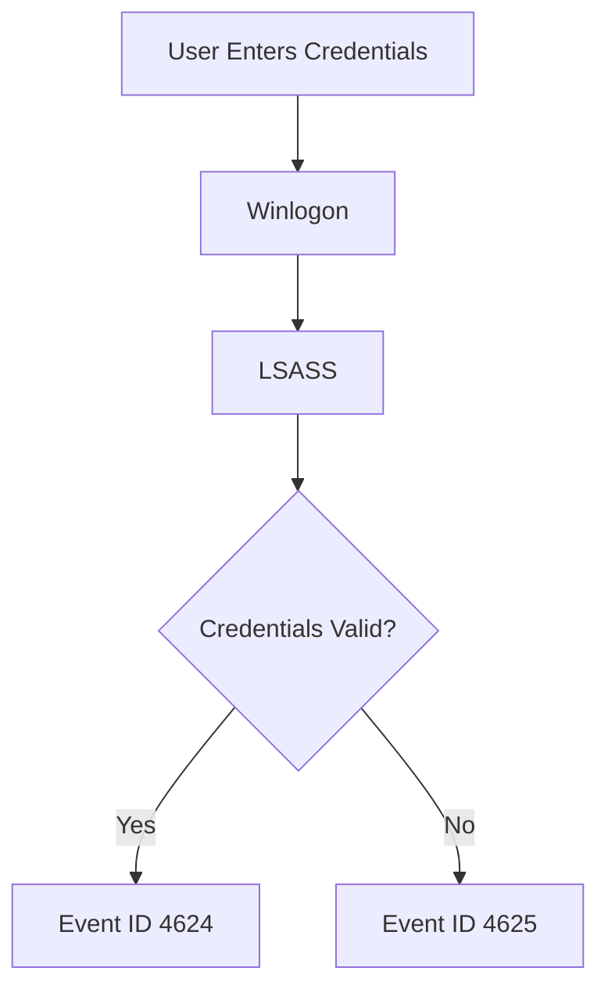
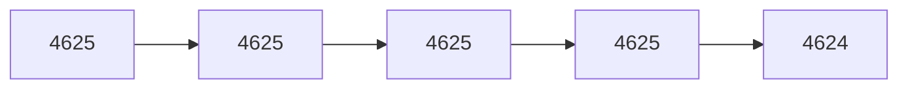
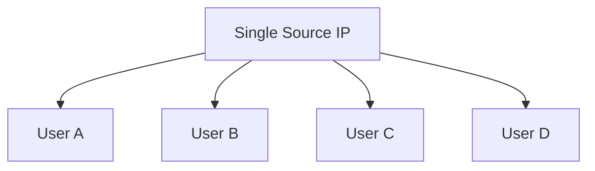
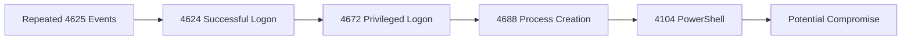

# Event ID 4625 – Failed Logon

[⬅️ Previous: Event ID 4624 – Successful Logon](4624-successful-logon.md) | [🏠 Authentication Overview](../authentication.md) | [➡️ Next: Event ID 4634 – Logoff](4634-logoff.md)


> 📖 **Reading Time:** 10 minutes

---

# Table of Contents

- Overview
- Why This Event Matters
- Event Information
- When Is Event ID 4625 Generated?
- Authentication Workflow
- Important Event Fields
- Logon Types
- NTSTATUS & SubStatus Codes
- Example Windows Event
- Common Attack Scenarios
- Investigation Playbook

---

# Overview

**Event ID 4625** is generated whenever Windows fails to authenticate a user, service account, or computer account.

A failed authentication attempt does **not automatically indicate malicious activity**. Users frequently mistype passwords, use expired credentials, or attempt to access disabled accounts.

However, repeated or unusual Event ID 4625 entries are often among the earliest indicators of attacks such as:

- Brute Force
- Password Spraying
- Credential Stuffing
- User Enumeration
- Lateral Movement
- Unauthorized Remote Desktop Access

For SOC Analysts, Event ID 4625 is one of the most valuable Windows Security Events because it frequently appears before a successful compromise.

---

# Why This Event Matters

Successful attacks often begin with failed authentication attempts.

A typical attack chain may look like:

```text
4625
4625
4625
4625
4624
4672
4688
```

The attacker repeatedly guesses passwords until authentication succeeds.

Monitoring Event ID 4625 helps defenders detect attacks **before privilege escalation or malware execution occurs.**

---

# Event Information

| Property | Value |
|----------|-------|
| Event ID | 4625 |
| Log Name | Security |
| Source | Microsoft Windows Security Auditing |
| Category | Logon |
| Trigger | Failed Authentication |
| Severity | Medium (Context Dependent) |
| Default Enabled | Yes |

---

# When Is Event ID 4625 Generated?

Windows records Event ID 4625 whenever authentication fails.

Examples include:

- Incorrect password
- Incorrect username
- Disabled account
- Locked account
- Expired account
- Expired password
- Smart card failure
- Kerberos authentication failure
- NTLM authentication failure
- Remote Desktop login failure

---

# Authentication Workflow



---

# Important Event Fields

| Field | Description | Investigation Value |
|--------|-------------|--------------------|
| TargetUserName | Username being authenticated | Primary account |
| TargetDomainName | Domain | Determine authentication scope |
| Status | Failure reason | Root cause |
| SubStatus | Detailed failure reason | Additional context |
| FailureReason | Human-readable explanation | Investigation |
| LogonType | Authentication method | Attack identification |
| AuthenticationPackage | Kerberos / NTLM | Protocol analysis |
| WorkstationName | Source computer | Device identification |
| IpAddress | Source IP | Critical evidence |
| ProcessName | Process requesting authentication | Detect unusual activity |

---

# Windows Logon Types

The **Logon Type** field provides context on how authentication was attempted.

| Logon Type | Description | Typical Example |
|------------|-------------|----------------|
| 2 | Interactive | User logs in locally |
| 3 | Network | SMB or shared folders |
| 4 | Batch | Scheduled Task |
| 5 | Service | Windows Service |
| 7 | Unlock | Unlock workstation |
| 8 | NetworkCleartext | IIS Authentication |
| 9 | NewCredentials | RunAs |
| 10 | Remote Interactive | Remote Desktop |
| 11 | Cached Interactive | Cached domain login |

> [!TIP]
> Logon Types **3** and **10** deserve special attention because they are frequently observed during lateral movement and unauthorized remote access.

---

# NTSTATUS & SubStatus Codes

Windows records hexadecimal error codes that explain *why* authentication failed.

| Status | Meaning | Analyst Action |
|---------|----------|---------------|
| 0xC0000064 | User does not exist | Investigate possible username enumeration |
| 0xC000006A | Incorrect password | Count repeated attempts |
| 0xC000006D | Bad username/password | Correlate with previous events |
| 0xC000006F | Outside allowed login hours | Verify policy |
| 0xC0000070 | Workstation restriction | Review source device |
| 0xC0000071 | Password expired | Usually legitimate |
| 0xC0000072 | Account disabled | Investigate source |
| 0xC0000193 | Account expired | Verify account lifecycle |
| 0xC0000234 | Account locked | Review previous failed logons |

> [!WARNING]
> Multiple 4625 events with **Status 0xC000006A** from the same IP often indicate brute-force attempts.

---

# Example Windows Event

```text
Event ID: 4625

Account Name:
Administrator

Failure Reason:
Unknown username or bad password

Status:
0xC000006D

Sub Status:
0xC000006A

Logon Type:
10

Authentication Package:
Negotiate

Source Network Address:
192.168.1.50

Workstation:
DESKTOP-01
```

---

# Understanding the Example

From the above event we know:

- Authentication failed.
- Remote Desktop was used.
- Administrator account was targeted.
- Source IP was 192.168.1.50.
- Incorrect password caused the failure.

If dozens of similar events occur from the same IP, the activity may indicate a brute-force attack.

---

# Common Attack Scenarios

## Scenario 1 — Brute Force

An attacker repeatedly guesses passwords for a single account.



Indicators:

- Same username
- Same source IP
- Hundreds of failures
- One successful login

---

## Scenario 2 — Password Spraying

Rather than attacking one account, attackers try one password against many users.



Characteristics:

- Same password
- Multiple usernames
- Few attempts per account

---

## Scenario 3 — Username Enumeration

The attacker first determines valid usernames.

Common pattern:

```text
4625
Status:
0xC0000064

↓

4625

↓

4625
```

Different error codes may reveal whether an account exists.

---

## Scenario 4 — Unauthorized RDP Access

Repeated failures using:

Logon Type **10**

Questions:

- Is RDP enabled?
- Is the source IP trusted?
- Is the account privileged?
- Was a successful Event ID 4624 generated afterward?

---

# Investigation Playbook

When investigating Event ID 4625:

1. Identify the targeted account.
2. Determine whether the account exists.
3. Review the Status and SubStatus codes.
4. Check the Logon Type.
5. Review the source IP address.
6. Determine whether Kerberos or NTLM was used.
7. Count failed attempts.
8. Search for a successful Event ID 4624.
9. Correlate with Event ID 4672.
10. Review Event ID 4688.
11. Review PowerShell Event ID 4104.
12. Build a timeline before concluding malicious activity.

---

# Detection Tips

Event ID **4625** is one of the most common Windows Security Events. While a single failed authentication attempt is usually benign, repeated or unusual failures can indicate malicious activity.

## What to Look For

- Multiple failed logons from the same source IP.
- Multiple failed logons targeting the same account.
- Failed logons occurring outside normal business hours.
- Numerous failed Remote Desktop (Logon Type 10) attempts.
- Password spraying across many accounts.
- Failed logons immediately followed by a successful **Event ID 4624**.
- Authentication attempts against disabled, expired, or locked accounts.
- NTLM authentication where Kerberos is expected.

> [!TIP]
> Event ID **4625** becomes significantly more valuable when correlated with **4624**, **4672**, and **4688**.

---

# Detection Logic

A common attack progression is:



Investigating this sequence can help identify compromised accounts before attackers establish persistence.

---

# Splunk Queries

## Find All Failed Logons

```spl
index=wineventlog EventCode=4625
| table _time, Account_Name, host, src_ip, Logon_Type
```

---

## Top Source IP Addresses

```spl
index=wineventlog EventCode=4625
| stats count by src_ip
| sort -count
```

---

## Top Targeted User Accounts

```spl
index=wineventlog EventCode=4625
| stats count by Account_Name
| sort -count
```

---

## Possible Brute Force Attack

```spl
index=wineventlog EventCode=4625
| bucket _time span=5m
| stats count by src_ip, _time
| where count > 20
```

---

## Possible Password Spraying

```spl
index=wineventlog EventCode=4625
| stats dc(Account_Name) as UsersTargeted count by src_ip
| where UsersTargeted > 10
```

---

# Microsoft Sentinel (KQL)

## Failed Logons

```kusto
SecurityEvent
| where EventID == 4625
| project TimeGenerated, Account, Computer, IpAddress, LogonType, FailureReason
| order by TimeGenerated desc
```

---

## Top Source IP Addresses

```kusto
SecurityEvent
| where EventID == 4625
| summarize Attempts=count() by IpAddress
| order by Attempts desc
```

---

## Detect Brute Force

```kusto
SecurityEvent
| where EventID == 4625
| summarize Attempts=count() by IpAddress, bin(TimeGenerated, 5m)
| where Attempts > 20
```

---

## Password Spraying Detection

```kusto
SecurityEvent
| where EventID == 4625
| summarize UsersTargeted=dcount(Account) by IpAddress
| where UsersTargeted > 10
```

---

# Sigma Rule Example

```yaml
title: Multiple Failed Logons
id: 9dcdb76e-4625-example
status: experimental
description: Detects possible brute-force authentication attempts.

logsource:
  product: windows
  service: security

detection:
  selection:
    EventID: 4625

  condition: selection

falsepositives:
  - User typing incorrect password
  - Service account configuration issues

level: medium
```

> [!NOTE]
> This is a simplified Sigma example. Production environments typically add thresholds, time windows, exclusions, and correlation logic.

---

# MITRE ATT&CK Mapping

| Technique | ID | Description |
|-----------|----|-------------|
| Brute Force | T1110 | Password guessing against one or more accounts |
| Valid Accounts | T1078 | Successful authentication after repeated failures |
| Remote Services | T1021 | Failed RDP or SMB authentication attempts |
| Password Spraying | T1110.003 | Single password used against multiple users |
| Credential Stuffing | T1110.004 | Stolen credentials tested against accounts |

---

# Common False Positives

Event ID **4625** is extremely common in enterprise environments.

Examples of legitimate causes include:

- Users mistyping passwords.
- Expired passwords.
- Cached credentials.
- Incorrectly configured services.
- Scheduled tasks using outdated credentials.
- VPN authentication failures.
- Network interruptions.
- Users forgetting recently changed passwords.

Always investigate the surrounding context before escalating an alert.

---

# Analyst Tips

> [!TIP]
> A single Event ID **4625** rarely indicates malicious activity.

> [!TIP]
> Look for authentication attempts from countries or IP addresses that users do not normally access from.

> [!TIP]
> Logon Type **10** (Remote Desktop) deserves higher priority than most failed local logons.

> [!TIP]
> Correlate failed authentication attempts with successful Event ID **4624** entries.

> [!TIP]
> Service accounts generating repeated Event ID 4625 entries often indicate configuration problems rather than attacks.

---

# Related Event IDs

| Event ID | Description | Why Correlate? |
|-----------|-------------|----------------|
| [4624](4624-successful-logon.md) | Successful Logon | Determine whether authentication eventually succeeded |
| [4634](4634-logoff.md) | Logoff | Identify session duration |
| [4648](4648-explicit-credentials.md) | Explicit Credentials | Detect alternate credential usage |
| [4672](4672-special-privileges.md) | Special Privileges Assigned | Determine if administrative privileges were granted |
| 4688 | Process Creation | Identify processes launched after authentication |
| 4698 | Scheduled Task Created | Detect persistence |
| 4697 | Service Installed | Detect persistence mechanisms |
| 4104 | PowerShell Script Block Logging | Detect PowerShell execution |
| 1102 | Audit Log Cleared | Possible anti-forensics |

---

# Investigation Checklist

Use the following checklist during investigations:

- [ ] Identify the affected account.
- [ ] Review the Status and SubStatus codes.
- [ ] Determine the Logon Type.
- [ ] Identify the source IP address.
- [ ] Check authentication protocol (Kerberos or NTLM).
- [ ] Count failed attempts.
- [ ] Search for a successful Event ID 4624.
- [ ] Determine whether privileged access was obtained (4672).
- [ ] Review process creation events (4688).
- [ ] Review PowerShell activity (4104).
- [ ] Build a complete timeline.
- [ ] Determine whether activity is expected or malicious.

---

# Key Takeaways

- Event ID **4625** records failed authentication attempts.
- A single failed logon is usually not suspicious.
- Multiple failures from the same IP can indicate brute-force attacks.
- Password spraying targets many users with a common password.
- Correlate Event ID 4625 with **4624**, **4672**, and **4688** for effective investigations.
- Always consider context before escalating an alert.

---

# References

- Microsoft Learn – Windows Security Auditing
- Microsoft Security Auditing Documentation
- Ultimate Windows Security Encyclopedia
- MITRE ATT&CK Framework
- Sigma Project
- NIST SP 800-61 Rev. 2 – Computer Security Incident Handling Guide

---

## Continue Reading

- [⬅️ Event ID 4624 – Successful Logon](4624-successful-logon.md)
- [🏠 Authentication Overview](../authentication.md)
- [➡️ Event ID 4634 – Logoff](4634-logoff.md)
