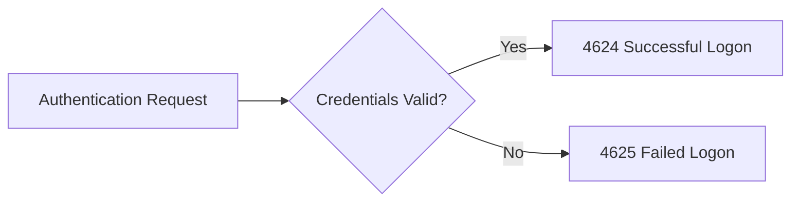
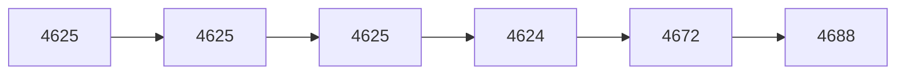
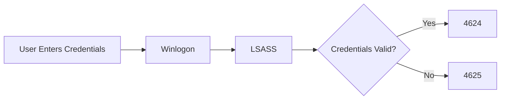
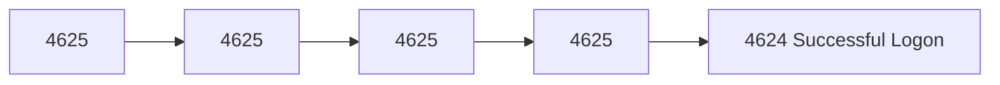
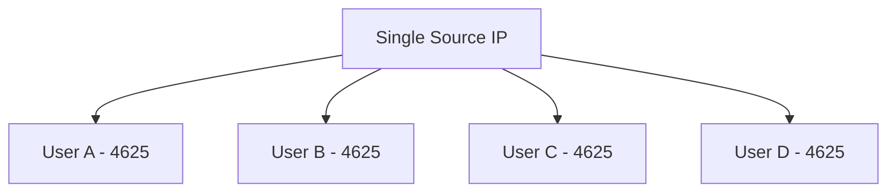
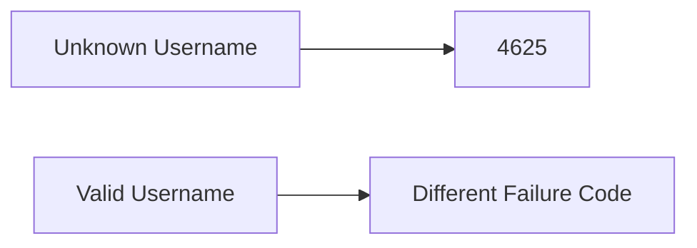
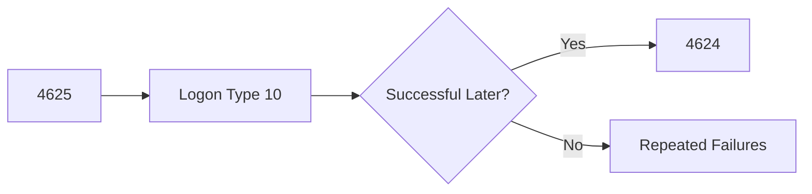
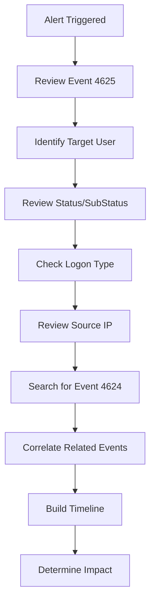

[⬅️ Event ID 4624 – Successful Logon](4624-successful-logon.md) | [🏠 Authentication Overview](../authentication.md) | [➡️ Next: Event ID 4634 – Logoff](4634-logoff.md)

---

# Event ID 4625 – Failed Logon


---

# Quick Facts

| Property | Value |
|----------|-------|
| **Event ID** | 4625 |
| **Category** | Authentication |
| **Log Source** | Windows Security Log |
| **Severity** | Medium *(Context Dependent)* |
| **MITRE ATT&CK** | T1110 – Brute Force |
| **Typical Volume** | High |
| **Detection Priority** | ⭐⭐⭐⭐⭐ |
| **Reading Time** | ~10 minutes |

---

# Table of Contents

- [Overview](#overview)
- [Why This Event Matters](#why-this-event-matters)
- [Event Information](#event-information)
- [When Is Event ID 4625 Generated?](#when-is-event-id-4625-generated)
- [Authentication Workflow](#authentication-workflow)
- [Important Event Fields](#important-event-fields)
- [Windows Logon Types](#windows-logon-types)
- [NTSTATUS & SubStatus Codes](#ntstatus--substatus-codes)
- [Example Windows Event](#example-windows-event)
- [Event XML Fields](#event-xml-fields)
- [Understanding the Example](#understanding-the-example)
- [Common Attack Scenarios](#common-attack-scenarios)
- [Analyst Interpretation](#analyst-interpretation)
- [Investigation Playbook](#investigation-playbook)
- [Detection Tips](#detection-tips)
- [Splunk Queries](#splunk-queries)
- [Microsoft Sentinel (KQL)](#microsoft-sentinel-kql)
- [Sigma Rule Example](#Sample-Sigma-Detection-Rule)
- [MITRE ATT&CK Mapping](#mitre-attck-mapping)
- [Common False Positives](#common-false-positives)
- [Analyst Tips](#analyst-tips)
- [Related Event IDs](#related-event-ids)
- [Investigation Checklist](#investigation-checklist)
- [Key Takeaways](#key-takeaways)
- [References](#references)

---

# Overview

**Event ID 4625** is generated whenever Windows fails to authenticate a **user**, **computer account**, or **service account**.

A failed authentication attempt does **not automatically indicate malicious activity**. Users frequently mistype passwords, use expired credentials, attempt to log in with disabled accounts, or encounter authentication policy restrictions.

However, repeated or unusual Event ID **4625** entries are among the earliest indicators of attacks such as:

- Brute Force
- Password Spraying
- Credential Stuffing
- Username Enumeration
- Pass-the-Hash
- Lateral Movement
- Unauthorized Remote Desktop Access



> [!IMPORTANT]
> Event ID **4625** is one of the most valuable Windows Security Events for SOC analysts because attackers almost always generate failed authentication attempts before gaining access.

---

# Why This Event Matters

Many real-world attacks begin with repeated authentication failures.

A common attack progression looks like this:



This sequence often represents:

- Password guessing
- Successful compromise
- Administrative access
- Post-exploitation activity

Monitoring Event ID **4625** allows defenders to detect attacks **before privilege escalation, persistence, or malware execution occurs.**

---

# Event Information

| Property | Value |
|----------|-------|
| **Event ID** | 4625 |
| **Log Name** | Security |
| **Provider** | Microsoft-Windows-Security-Auditing |
| **Category** | Logon |
| **Trigger** | Failed authentication |
| **Default Enabled** | Yes |

---

# When Is Event ID 4625 Generated?

Windows generates Event ID **4625** whenever an authentication attempt fails.

Common reasons include:

- Incorrect password
- Unknown username
- Disabled account
- Locked account
- Expired account
- Expired password
- Smart card authentication failure
- Kerberos authentication failure
- NTLM authentication failure
- Remote Desktop authentication failure
- Logon policy restrictions

---

# Authentication Workflow



> [!TIP]
> Understanding the Windows authentication workflow helps analysts determine whether failures originate from user mistakes, authentication policies, or attacker activity.

---

# Important Event Fields

| Field | Description | Investigation Value |
|--------|-------------|--------------------|
| **TargetUserName** | Account being authenticated | Primary account under investigation |
| **TargetDomainName** | User domain | Authentication scope |
| **Status** | Primary failure code | Root cause |
| **SubStatus** | Detailed failure code | Additional context |
| **FailureReason** | Human-readable explanation | Quick triage |
| **LogonType** | Authentication method | Attack identification |
| **AuthenticationPackageName** | Kerberos or NTLM | Protocol analysis |
| **IpAddress** | Source IP | Critical investigation artifact |
| **WorkstationName** | Source endpoint | Device identification |
| **ProcessName** | Process requesting authentication | Detect abnormal authentication |

---

# Windows Logon Types

The **Logon Type** field explains how authentication was attempted.

| Logon Type | Name | Typical Example | Investigation Priority |
|------------|------|-----------------|------------------------|
| **2** | Interactive | Local console login | 🟢 Low |
| **3** | Network | SMB, shared folders | 🟡 Medium |
| **4** | Batch | Scheduled Tasks | 🟢 Low |
| **5** | Service | Windows Services | 🟢 Low |
| **7** | Unlock | Unlock workstation | 🟢 Low |
| **8** | NetworkCleartext | IIS, Basic Authentication | 🟠 High |
| **9** | NewCredentials | RunAs | 🟠 High |
| **10** | RemoteInteractive | Remote Desktop (RDP) | 🔴 Very High |
| **11** | CachedInteractive | Cached domain logon | 🟢 Low |

> [!TIP]
> Logon Types **3** and **10** are the most commonly investigated because they frequently appear during lateral movement and unauthorized remote access.

---

# NTSTATUS & SubStatus Codes

One of the most valuable sections of Event ID **4625** is the **Status** and **SubStatus** fields.

These hexadecimal codes explain **why authentication failed**.

| Status Code | Meaning | Analyst Action |
|-------------|----------|----------------|
| **0xC0000064** | Username does not exist | Investigate username enumeration |
| **0xC000006A** | Incorrect password | Count repeated attempts |
| **0xC000006D** | Bad username or password | Correlate with previous failures |
| **0xC000006E** | Account restriction | Review account policies |
| **0xC000006F** | Outside allowed logon hours | Verify policy configuration |
| **0xC0000070** | Workstation restriction | Review source device |
| **0xC0000071** | Password expired | Usually legitimate |
| **0xC0000072** | Account disabled | Investigate authentication source |
| **0xC0000133** | Time difference between client and Domain Controller | Check time synchronization |
| **0xC000015B** | Logon type not granted | Review user rights assignment |
| **0xC000018C** | Trust relationship failure | Investigate domain trust |
| **0xC0000192** | Netlogon service not running | Verify service health |
| **0xC0000193** | Account expired | Verify account lifecycle |
| **0xC0000224** | User must change password | Usually legitimate |
| **0xC0000234** | Account locked | Review previous failed logons |

> [!WARNING]
> Numerous Event ID **4625** entries with **Status 0xC000006A** from the same source IP are one of the strongest indicators of a brute-force attack.

# Example Windows Event

Below is a simplified example of a Windows Security Event **4625**.

```text
Log Name:      Security
Source:        Microsoft-Windows-Security-Auditing
Event ID:      4625
Task Category: Logon
Level:         Information

Subject:
    Security ID:        NULL SID
    Account Name:       -
    Account Domain:     -
    Logon ID:           0x0

Account For Which Logon Failed:
    Security ID:        NULL SID
    Account Name:       Administrator
    Account Domain:     CONTOSO

Failure Information:
    Failure Reason:     Unknown user name or bad password
    Status:             0xC000006D
    Sub Status:         0xC000006A

Process Information:
    Caller Process Name: -

Network Information:
    Workstation Name:   WIN11-CLIENT
    Source Network Address: 192.168.1.50
    Source Port:        51422

Detailed Authentication Information:
    Logon Process:      User32
    Authentication Package: Negotiate
    Logon Type:         10
```

This example represents a failed **Remote Desktop (RDP)** authentication attempt against the **Administrator** account due to an incorrect password.

---

# Event XML Fields

Most SIEM platforms parse the XML representation of Windows Event Logs rather than the human-readable format.

The following fields are commonly extracted for detection and investigation.

| XML Field | Description |
|-----------|-------------|
| **TargetUserName** | Account that failed authentication |
| **TargetDomainName** | Domain associated with the account |
| **Status** | Primary NTSTATUS failure code |
| **SubStatus** | Detailed failure reason |
| **FailureReason** | Human-readable explanation |
| **LogonType** | Authentication method |
| **AuthenticationPackageName** | Kerberos or NTLM |
| **IpAddress** | Source IP address |
| **IpPort** | Source network port |
| **WorkstationName** | Originating endpoint |
| **ProcessName** | Process requesting authentication |

> [!NOTE]
> Field names may vary slightly depending on whether logs are collected using Windows Event Forwarding (WEF), Splunk, Microsoft Sentinel, Elastic, or another SIEM.

---

# Understanding the Example

From the previous event, we can determine:

| Observation | Interpretation |
|-------------|----------------|
| Event ID **4625** | Authentication failed |
| Logon Type **10** | Attempted Remote Desktop login |
| Target Account | Administrator |
| Status **0xC000006D** | Authentication failed |
| SubStatus **0xC000006A** | Incorrect password |
| Source IP | 192.168.1.50 |
| Authentication Package | Negotiate (Kerberos/NTLM) |

> [!TIP]
> One failed login is usually harmless. Hundreds of similar events from the same IP within a short period should be investigated immediately.

---

# Common Attack Scenarios

---

## Scenario 1 — Brute Force Attack

An attacker repeatedly guesses passwords for a single account until one succeeds.



### Indicators

- Same username
- Same source IP
- Large number of failures
- Successful authentication afterward

Investigate:

- Source IP reputation
- Previous authentication history
- Password policy
- Geographic location of the source

---

## Scenario 2 — Password Spraying

Instead of guessing many passwords for one account, attackers try **one common password** against many users.



### Characteristics

- Same password
- Many usernames
- Very few attempts per account
- Designed to avoid account lockout

---

## Scenario 3 — Username Enumeration

Attackers attempt to discover valid usernames before launching password attacks.



Indicators include:

- Numerous unknown usernames
- Different NTSTATUS codes
- Sequential username attempts

---

## Scenario 4 — Unauthorized Remote Desktop



Questions to ask:

- Is RDP enabled?
- Is the source IP trusted?
- Is MFA enabled?
- Has this user authenticated successfully before?

---

# Analyst Interpretation

The table below summarizes how SOC analysts commonly interpret Event ID **4625** patterns.

| Pattern | Typical Interpretation |
|----------|------------------------|
| Single failed login | Usually user error |
| Multiple failures within one minute | Possible mistyped password or brute force |
| Hundreds of failures from one IP | Brute-force attack |
| One password against many users | Password spraying |
| Unknown usernames | Username enumeration |
| Failed RDP logons (Type 10) | Investigate remote access |
| Failures followed by Event ID 4624 | Possible account compromise |
| NTLM authentication in a Kerberos environment | Investigate legacy systems or Pass-the-Hash activity |

> [!IMPORTANT]
> Analysts should focus on **authentication patterns**, not isolated events. A single Event ID **4625** rarely justifies escalation, but repeated failures, multiple targeted accounts, or suspicious authentication methods often require immediate investigation.

---

# Investigation Playbook



When investigating Event ID **4625**, answer the following questions:

- Does the targeted account exist?
- Why did authentication fail?
- Was Kerberos or NTLM used?
- What Logon Type was requested?
- Is the source IP expected?
- How many failures occurred?
- Did authentication eventually succeed?
- Were administrative privileges later assigned (4672)?
- Were suspicious processes launched (4688)?
- Was PowerShell executed (4104)?

> [!WARNING]
> Authentication failures should always be correlated with successful logons, privilege assignments, and process creation before concluding that malicious activity occurred.

---

# Detection Tips

SOC analysts should prioritize the following behaviors:

- Multiple failed logons from a single IP address.
- Multiple failed logons targeting the same account.
- Password spraying against many users.
- Failed Remote Desktop (Logon Type 10) attempts.
- Failed NTLM authentication where Kerberos is expected.
- Authentication attempts against disabled or expired accounts.
- Repeated failures followed by Event ID **4624**.
- Authentication failures originating from unusual geographic locations.

> [!TIP]
> Event ID **4625** becomes significantly more valuable when correlated with **4624**, **4672**, **4688**, **4768**, **4769**, and **4776**.

# Splunk Queries

The following Splunk queries can help identify authentication attacks involving Event ID **4625**.

---

## Find All Failed Logons

```spl
index=wineventlog EventCode=4625
| table _time, Account_Name, src_ip, host, Logon_Type
```

### What this query does

Displays all failed authentication attempts along with:

- Time
- Target account
- Source IP
- Host
- Logon Type

Useful for initial triage.

---

## Top Source IP Addresses

```spl
index=wineventlog EventCode=4625
| stats count by src_ip
| sort -count
```

### What this query does

Identifies IP addresses generating the highest number of failed authentication attempts.

Useful for detecting:

- Brute-force attacks
- Password spraying
- Misconfigured systems

---

## Top Targeted User Accounts

```spl
index=wineventlog EventCode=4625
| stats count by Account_Name
| sort -count
```

### What this query does

Shows which accounts are being targeted most frequently.

Investigate accounts such as:

- Administrator
- Domain Admins
- Service Accounts
- Executive users

---

## Detect Possible Brute Force

```spl
index=wineventlog EventCode=4625
| bucket _time span=5m
| stats count by src_ip, _time
| where count > 20
```

### What this query does

Detects more than **20 failed authentication attempts within five minutes** from the same IP address.

Adjust the threshold to match your environment.

---

## Detect Password Spraying

```spl
index=wineventlog EventCode=4625
| stats dc(Account_Name) as UsersTargeted count by src_ip
| where UsersTargeted > 10
```

### What this query does

Identifies source IP addresses attempting authentication against numerous different user accounts.

---

# Microsoft Sentinel (KQL)

---

## Find Failed Logons

```kusto
SecurityEvent
| where EventID == 4625
| project
    TimeGenerated,
    Account,
    Computer,
    IpAddress,
    LogonType,
    FailureReason
| order by TimeGenerated desc
```

### What this query does

Returns recent failed authentication attempts.

---

## Top Source IP Addresses

```kusto
SecurityEvent
| where EventID == 4625
| summarize Attempts=count() by IpAddress
| order by Attempts desc
```

### What this query does

Shows which IP addresses generate the most failed logons.

---

## Detect Brute Force

```kusto
SecurityEvent
| where EventID == 4625
| summarize Attempts=count()
by IpAddress, bin(TimeGenerated,5m)
| where Attempts > 20
```

### What this query does

Detects repeated failed authentication attempts from the same IP within five minutes.

---

## Detect Password Spraying

```kusto
SecurityEvent
| where EventID == 4625
| summarize UsersTargeted=dcount(Account)
by IpAddress
| where UsersTargeted > 10
```

### What this query does

Identifies IP addresses attempting one or more passwords against many different accounts.

---

# Sample Sigma Detection Rule

```yaml
title: Multiple Failed Logons
id: d95d7b70-4625-bruteforce-example
status: experimental

description: Detects repeated failed authentication attempts.

logsource:
  product: windows
  service: security

detection:
  selection:
    EventID: 4625

  condition: selection

falsepositives:
  - User entering incorrect password
  - Service account configuration issues

level: medium
```

> [!NOTE]
> Production Sigma rules generally include thresholds, aggregation, exclusions, and time windows to reduce false positives.

---

# MITRE ATT&CK Mapping

| Technique | ATT&CK ID | Description |
|-----------|-----------|-------------|
| Brute Force | **T1110** | Password guessing against one or more accounts |
| Password Spraying | **T1110.003** | One password used against many accounts |
| Credential Stuffing | **T1110.004** | Stolen credentials tested against accounts |
| Valid Accounts | **T1078** | Successful authentication after repeated failures |
| Remote Services | **T1021** | Failed RDP or SMB authentication attempts |

> [!IMPORTANT]
> Event ID **4625** represents **failed authentication**, not confirmed compromise. Always correlate with additional telemetry before mapping attacker behavior.

---

# Common False Positives

Most Event ID **4625** events are legitimate.

Examples include:

- Users entering an incorrect password.
- Recently changed passwords.
- Expired passwords.
- Locked or disabled accounts.
- Cached credentials.
- Scheduled tasks using outdated credentials.
- Services configured with incorrect passwords.
- VPN authentication failures.
- Temporary network issues.
- Domain Controller replication delays.

> [!TIP]
> Focus on **authentication patterns**, not isolated failures.

---

# Analyst Tips

Experienced SOC analysts rarely investigate Event ID **4625** in isolation.

### Best Practices

- Review the **Status** and **SubStatus** codes first.
- Prioritize **Logon Type 10** (Remote Desktop).
- Investigate repeated failures from the same source IP.
- Compare authentication times with normal user behavior.
- Search for a subsequent **Event ID 4624**.
- Determine whether administrative privileges were assigned (4672).
- Review process creation (4688).
- Check for PowerShell execution (4104).
- Build a complete authentication timeline before escalating.

---

# Related Event IDs

| Event ID | Description | Why Correlate? |
|-----------|-------------|----------------|
| **4624** | Successful Logon | Determine whether authentication eventually succeeded |
| **4634** | Logoff | Review session duration |
| **4648** | Explicit Credentials | Detect alternate credential usage |
| **4672** | Special Privileges Assigned | Determine whether elevated privileges were granted |
| **4688** | Process Creation | Review activity after authentication |
| **4697** | Service Installation | Detect persistence |
| **4698** | Scheduled Task Created | Detect persistence |
| **4768** | Kerberos TGT Request | Review Kerberos authentication |
| **4769** | Kerberos Service Ticket | Detect lateral movement |
| **4771** | Kerberos Pre-Authentication Failure | Review Kerberos failures |
| **4776** | NTLM Credential Validation | Review NTLM authentication |
| **4104** | PowerShell Script Block Logging | Detect post-authentication activity |
| **1102** | Audit Log Cleared | Detect anti-forensics |

---

# Investigation Checklist

Use the following checklist when triaging Event ID **4625**.

- [ ] Identify the targeted account.
- [ ] Determine whether the account exists.
- [ ] Review the Status and SubStatus codes.
- [ ] Determine the Logon Type.
- [ ] Identify the authentication package.
- [ ] Identify the source IP address.
- [ ] Count failed authentication attempts.
- [ ] Search for a successful Event ID **4624**.
- [ ] Review Event ID **4672**.
- [ ] Review Event ID **4688**.
- [ ] Review PowerShell activity (4104).
- [ ] Build a complete authentication timeline.

---

# Key Takeaways

- Event ID **4625** records every failed authentication attempt.
- A single failed logon is usually benign.
- Multiple failures from one IP often indicate brute-force activity.
- One password against many users suggests password spraying.
- Status and SubStatus codes explain **why** authentication failed.
- Always correlate Event ID **4625** with **4624**, **4672**, **4688**, **4768**, **4769**, and **4776**.
- Context determines whether an event is malicious.

---

# References

- Microsoft Learn – Windows Security Auditing  
  https://learn.microsoft.com/windows/security/

- Windows Security Auditing Documentation  
  https://learn.microsoft.com/windows/security/threat-protection/auditing/

- Ultimate Windows Security Encyclopedia  
  https://www.ultimatewindowssecurity.com/securitylog/

- MITRE ATT&CK – Brute Force (T1110)  
  https://attack.mitre.org/techniques/T1110/

- SigmaHQ Repository  
  https://github.com/SigmaHQ/sigma

- NIST SP 800-61 Rev. 2 – Computer Security Incident Handling Guide  
  https://csrc.nist.gov/publications/detail/sp/800-61/rev-2/final

---

# Continue Learning

Understanding failed logons becomes much easier when correlated with related authentication events.

| Event ID | Description |
|-----------|-------------|
| **4624** | Successful Logon |
| **4634** | Logoff |
| **4648** | Logon Using Explicit Credentials |
| **4672** | Special Privileges Assigned |
| **4768** | Kerberos Ticket Granting Ticket (TGT) |
| **4769** | Kerberos Service Ticket |
| **4771** | Kerberos Pre-Authentication Failure |
| **4776** | NTLM Credential Validation |

---

## Navigation

⬅️ **Previous:** [Event ID 4624 – Successful Logon](4624-successful-logon.md)

🏠 **Authentication Overview:** [Authentication Events](../authentication.md)

➡️ **Next:** [Event ID 4634 – Logoff](4634-logoff.md)
