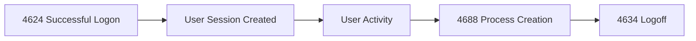
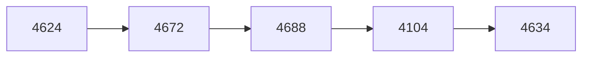
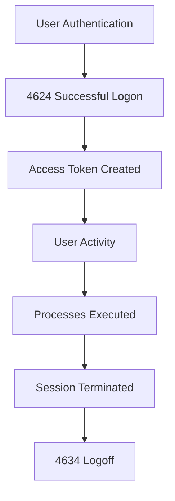
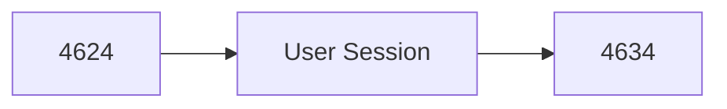
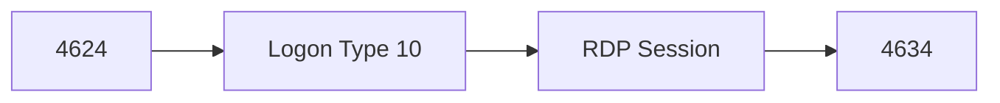

[⬅️ Previous: Event ID 4625 – Failed Logon](4625-failed-logon.md) | [🏠 Authentication Overview](../authentication.md) | [➡️ Next: Event ID 4648 – Explicit Credentials](4648-explicit-credentials.md)

---

# Event ID 4634 – Logoff


---

# Quick Facts

| Property | Value |
|----------|-------|
| **Event ID** | 4634 |
| **Category** | Logoff |
| **Log Source** | Windows Security Log |
| **Severity** | Informational |
| **Trigger** | User session terminated |
| **Typical Volume** | High |
| **Detection Priority** | ⭐⭐⭐☆☆ |
| **Related Events** | 4624, 4647, 4779 |
| **Reading Time** | ~7 minutes |

---

# Table of Contents

- [Overview](#overview)
- [Why This Event Matters](#why-this-event-matters)
- [Event Information](#event-information)
- [Windows Session Lifecycle](#windows-session-lifecycle)
- [When Is Event ID 4634 Generated?](#when-is-event-id-4634-generated)
- [Important Event Fields](#important-event-fields)
- [Logon Types](#logon-types)
- [Example Windows Event](#example-windows-event)
- [Event XML Fields](#event-xml-fields)
- [Understanding the Example](#understanding-the-example)
- [Common Logoff Scenarios](#common-logoff-scenarios)
- [Investigation Playbook](#investigation-playbook)
- [Detection Tips](#detection-tips)
- [Session Duration Analysis](#session-duration-analysis)
- [SIEM Queries](#splunk-queries)
- [MITRE ATT&CK Mapping](#mitre-attck-mapping)
- [False Positives](#common-false-positives)
- [Analyst Tips](#analyst-tips)
- [Related Event IDs](#related-event-ids)
- [Checklist](#investigation-checklist)
- [References](#references)

---

# Overview

**Event ID 4634** is generated when a user or service session is terminated.

A logoff event indicates that an authenticated session created by **Event ID 4624 (Successful Logon)** has ended.

Unlike failed authentication events, Event ID **4634** is usually not considered a detection event by itself. Instead, it provides valuable context during investigations by showing:

- When a session ended
- Which account was logged off
- Which logon session was terminated
- How long the session existed
- Whether suspicious activity occurred before termination



> [!IMPORTANT]
> Event ID **4634** rarely indicates malicious activity alone. Its value comes from correlating it with authentication, process execution, privilege changes, and network activity.

---

# Why This Event Matters

A logoff event helps analysts understand the complete lifecycle of a Windows session.

Security teams use Event ID 4634 to answer questions such as:

- When did the user session end?
- Was the session duration normal?
- Did suspicious activity occur before logoff?
- Was an attacker attempting to hide activity?
- Did a privileged account log off after executing commands?
- Was a remote session terminated?

A complete authentication timeline often looks like:



Example interpretation:

```
4624
User authenticated

↓

4672
Administrative privileges assigned

↓

4688
Process executed

↓

4104
PowerShell activity

↓

4634
Session ended
```

This timeline provides much more context than viewing a single event.

---

# Event Information

| Property | Value |
|----------|-------|
| **Event ID** | 4634 |
| **Log Name** | Security |
| **Provider** | Microsoft-Windows-Security-Auditing |
| **Category** | Logoff |
| **Trigger** | User session termination |
| **Default Enabled** | Yes |

---

# Windows Session Lifecycle

A Windows user session normally follows this lifecycle:



---

# When Is Event ID 4634 Generated?

Windows generates Event ID **4634** when a logon session ends.

Common causes include:

- User manually logging off
- Remote Desktop session ending
- System shutdown
- User switching accounts
- Service account session termination
- Session timeout
- Administrative session termination

Examples:

### Normal Scenario

```
08:00

4624
User logs in

↓

17:00

4634
User logs off
```

Expected employee activity.

---

### Suspicious Scenario

```
02:15

4624
Administrator login

↓

02:16

4688
cmd.exe executed

↓

02:17

4634
Session terminated
```

Potentially suspicious depending on context.

---

# Important Event Fields

| Field | Description | Investigation Value |
|-------|-------------|--------------------|
| **TargetUserName** | Account that logged off | Identifies user |
| **TargetDomainName** | User domain | Authentication scope |
| **TargetLogonId** | Unique session identifier | Correlates with other events |
| **LogonType** | Type of session | Determines access method |
| **SubjectUserName** | Account responsible for event | Event initiator |
| **SubjectLogonId** | Identifier of creating session | Correlation |
| **Computer** | Host generating event | Asset identification |

> [!TIP]
> The most important field in Event ID **4634** is the **TargetLogonId**. Analysts use it to correlate the logoff event with the original **4624 Successful Logon** event.

---

# Logon Types

The Logon Type field indicates what type of session was terminated.

| Logon Type | Name | Example |
|------------|------|---------|
| **2** | Interactive | Local workstation login |
| **3** | Network | SMB/network access |
| **4** | Batch | Scheduled tasks |
| **5** | Service | Windows services |
| **7** | Unlock | Workstation unlock |
| **8** | NetworkCleartext | Basic authentication |
| **9** | NewCredentials | RunAs |
| **10** | RemoteInteractive | Remote Desktop |
| **11** | CachedInteractive | Cached domain login |

> [!NOTE]
> Event ID **4634** does not explain *why* the session ended. Analysts must correlate it with other events to determine whether the termination was normal or suspicious.

---

# Example Windows Event

```text
Log Name:
Security

Source:
Microsoft-Windows-Security-Auditing

Event ID:
4634

Task Category:
Logoff


Account Name:
Administrator

Account Domain:
CONTOSO

Logon ID:
0x45A92

Logon Type:
10

Computer:
SERVER01
```

---

# Understanding the Example

From this event we know:

| Observation | Interpretation |
|-------------|----------------|
| Event ID 4634 | Session ended |
| Account | Administrator |
| Logon Type 10 | Remote Desktop session |
| Logon ID | Used for event correlation |
| Computer | SERVER01 |

The analyst should now search for:

- The matching **4624** event
- Commands executed during the session
- Privilege assignments
- Network activity

---
---

# Event XML Fields

Windows stores security events internally as XML data.

A simplified Event ID 4634 structure looks like:

```xml
<Event>
  <System>
    <EventID>4634</EventID>
    <Provider>
      Microsoft-Windows-Security-Auditing
    </Provider>
  </System>

  <EventData>

    <Data Name="TargetUserName">
      Administrator
    </Data>

    <Data Name="TargetDomainName">
      CONTOSO
    </Data>

    <Data Name="TargetLogonId">
      0x45A92
    </Data>

    <Data Name="LogonType">
      10
    </Data>

  </EventData>
</Event>
```

Important XML fields:

| XML Field | Purpose |
|-----------|---------|
| TargetUserName | User whose session ended |
| TargetLogonId | Connects logoff with previous events |
| LogonType | Identifies session type |
| TargetDomainName | Domain information |

---

# Common Logoff Scenarios

## Scenario 1 — Normal User Logoff

A regular employee logs out after finishing work.



Example:

```
08:30

4624
User login

↓

17:30

4634
User logoff
```

Expected behavior:

- Normal working hours
- Known workstation
- Expected user account

---

# Scenario 2 — Remote Desktop Session Ends

Remote sessions generate logoff events when disconnected or terminated.



Investigate:

- Was RDP expected?
- Was the source IP trusted?
- Was the account privileged?
- What activity occurred before disconnect?

---

# Scenario 3 — Attacker Terminates Session After Activity

Attackers may log off after performing actions to reduce visibility.

Example:


Possible activity:

```
4624
Administrator login

↓

4672
Elevated privileges

↓

4688
cmd.exe

↓

4104
PowerShell execution

↓

4634
Logoff
```

This requires investigation.

---

# Scenario 4 — System Shutdown

Windows may generate logoff events when shutting down.

Example:

```
User Session

↓

System Shutdown

↓

4634
Session terminated
```

Usually legitimate unless:

- Occurs unexpectedly
- Happens during an intrusion
- Affected multiple systems

---

# Investigation Playbook

When investigating Event ID **4634**, follow these steps:

---

## Step 1 — Identify the Account

Review:

- TargetUserName
- Domain
- Computer

Questions:

- Is this a known user?
- Is this account privileged?
- Is this a service account?

---

## Step 2 — Find Matching Logon Event

Search for:

```
Event ID 4624

TargetLogonId = Same Logon ID
```

Example:

```
4624

Logon ID:
0x45A92

↓

4634

Logon ID:
0x45A92
```

This connects the beginning and end of the session.

---

## Step 3 — Review Session Activity

Check events between logon and logoff.

Important events:

| Event ID | Purpose |
|----------|---------|
| 4688 | Process creation |
| 4104 | PowerShell execution |
| 4672 | Privileged access |
| 4698 | Scheduled task creation |
| 4697 | Service installation |

---

## Step 4 — Analyze Session Duration

Ask:

- Was the duration normal?
- Did activity happen immediately after login?
- Did the session end unusually quickly?

---

## Step 5 — Determine Risk

Consider:

| Question | Risk |
|----------|------|
| Privileged account? | Higher |
| Remote login? | Higher |
| Unknown IP? | Higher |
| After-hours activity? | Higher |
| Suspicious processes? | Higher |

---

# Session Duration Analysis

Event ID 4634 becomes more valuable when combined with Event ID 4624.

---

## Normal Session

```
4624

08:00
User Login


4634

17:00
User Logoff
```

Duration:

```
≈ 9 hours
```

Likely normal.

---

## Suspicious Short Session

```
4624

03:15
Administrator Login


4688

03:16
powershell.exe


4634

03:17
Logoff
```

Duration:

```
≈ 2 minutes
```

Possible:

- Automated attack
- Unauthorized administration
- Script execution

---

# Detection Tips

Event ID 4634 is usually used for correlation rather than standalone detection.

Look for:

- Privileged accounts logging off after suspicious activity.
- RDP sessions ending shortly after login.
- Sessions from unusual locations.
- Multiple administrative logoffs.
- Logoff immediately after command execution.
- Sessions ending after security tools are disabled.

> [!TIP]
> A suspicious logoff is usually identified by what happened **before** it, not the logoff itself.

---

# Splunk Queries

## Find All Logoff Events

```spl
index=wineventlog EventCode=4634
| table _time, Account_Name, host, Logon_Type
```

---

## Track User Session Timeline

```spl
index=wineventlog (EventCode=4624 OR EventCode=4634)

| table _time,
Account_Name,
EventCode,
Logon_ID,
Logon_Type
```

Purpose:

Creates a basic authentication timeline.

---

## Find Remote Desktop Logoffs

```spl
index=wineventlog EventCode=4634
Logon_Type=10

| table _time,
Account_Name,
host
```

---

## Find Administrative Session Terminations

```spl
index=wineventlog

(EventCode=4634 OR EventCode=4672)

| table _time,
Account_Name,
EventCode
```

---

# Microsoft Sentinel (KQL)

## Find Logoff Events

```kusto
SecurityEvent
| where EventID == 4634
| project
    TimeGenerated,
    Account,
    Computer,
    LogonType
| order by TimeGenerated desc
```

---

## Correlate Login and Logoff

```kusto
SecurityEvent
| where EventID in (4624,4634)
| project
    TimeGenerated,
    EventID,
    Account,
    LogonId,
    Computer
| order by TimeGenerated asc
```

---

# Sigma Rule Example

```yaml
title: Privileged Account Logoff Detection

id: 4634-logoff-example

status: experimental

description: Detects logoff events from privileged accounts.

logsource:
  product: windows
  service: security

detection:

  selection:
    EventID: 4634

  condition:
    selection

falsepositives:
  - Normal administrator activity

level: low
```

> [!NOTE]
> Real-world Sigma rules usually include account groups, time conditions, and correlation with suspicious activity.

---

# MITRE ATT&CK Mapping

Event ID **4634** does not directly represent an attack technique.

However, it supports investigation of:

| Technique | ID | Relationship |
|-----------|----|--------------|
| Valid Accounts | T1078 | Tracking legitimate accounts used by attackers |
| Remote Services | T1021 | Investigating RDP/SMB sessions |
| Indicator Removal | T1070 | Detecting suspicious cleanup activity |

---

# Common False Positives

Most Event ID 4634 events are expected.

Examples:

- Normal employee logout.
- Automatic session expiration.
- Server maintenance.
- Scheduled service termination.
- System shutdown.
- RDP disconnects.

A logoff event alone should rarely trigger an alert.

---

# Analyst Tips

> [!TIP]
> Event ID 4634 is valuable because it completes the authentication timeline.

> [!TIP]
> Always correlate the Logon ID with Event ID 4624.

> [!TIP]
> Short privileged sessions deserve additional investigation.

> [!TIP]
> RDP logoffs should be reviewed when the source system is unknown.

> [!TIP]
> Focus on the activity between login and logoff.

---

# Related Event IDs

| Event ID | Description | Why Correlate |
|----------|-------------|---------------|
| [4624](4624-successful-logon.md) | Successful Logon | Identify session creation |
| [4625](4625-failed-logon.md) | Failed Logon | Detect attacks before login |
| 4647 | User Initiated Logoff | User manually logged out |
| 4672 | Special Privileges Assigned | Identify elevated sessions |
| 4688 | Process Creation | Detect executed commands |
| 4697 | Service Installed | Detect persistence |
| 4698 | Scheduled Task Created | Detect persistence |
| 4779 | RDP Session Disconnect | Analyze remote sessions |
| 1102 | Audit Log Cleared | Detect anti-forensics |

---

# Investigation Checklist

Use this checklist during Event ID 4634 analysis:

- [ ] Identify the logged-off account.
- [ ] Check whether the account is privileged.
- [ ] Find the matching Event ID 4624.
- [ ] Compare Logon IDs.
- [ ] Determine Logon Type.
- [ ] Review source IP address.
- [ ] Analyze session duration.
- [ ] Review processes executed.
- [ ] Check PowerShell activity.
- [ ] Look for persistence activity.
- [ ] Determine whether logoff was expected.

---

# Key Takeaways

- Event ID **4634** records terminated Windows sessions.
- It is primarily a correlation event, not a standalone detection.
- The **Logon ID** is the most important field for investigation.
- Combine 4634 with **4624** to understand session lifetime.
- Short privileged sessions may require investigation.
- Always analyze what happened before the logoff.

---

# References

- Microsoft Learn – Windows Security Auditing  
https://learn.microsoft.com/windows/security/

- Windows Security Auditing Documentation  
https://learn.microsoft.com/windows/security/threat-protection/auditing/

- Ultimate Windows Security Encyclopedia  
https://www.ultimatewindowssecurity.com/securitylog/

- MITRE ATT&CK Framework  
https://attack.mitre.org/

- SigmaHQ  
https://github.com/SigmaHQ/sigma

---

# Continue Reading

| Event ID | Description |
|----------|-------------|
| [4624](4624-successful-logon.md) | Successful Logon |
| [4625](4625-failed-logon.md) | Failed Logon |
| **4634** | Logoff |
| [4648](4648-explicit-credentials.md) | Explicit Credentials |
| [4672](4672-special-privileges.md) | Special Privileges Assigned |

---

## Navigation

⬅️ Previous: [Event ID 4625 – Failed Logon](4625-failed-logon.md)

🏠 Home: [Authentication Overview](../authentication.md)

➡️ Next: [Event ID 4648 – Explicit Credentials](4648-explicit-credentials.md)
