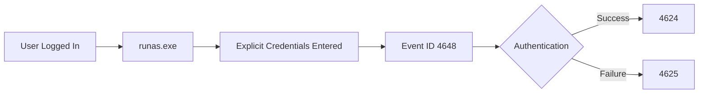
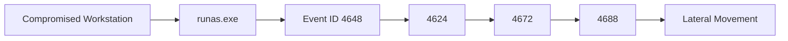
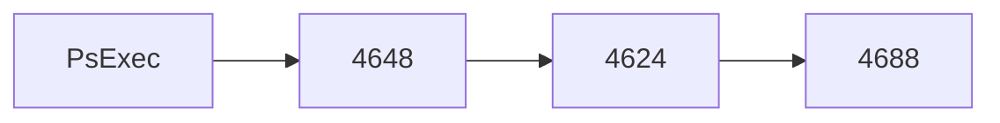
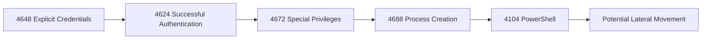

[⬅️ Previous: Event ID 4634 – Logoff](4634-logoff.md) | [🏠 Authentication Overview](../authentication.md) | [➡️ Next: Event ID 4672 – Special Privileges Assigned](4672-special-privileges.md)

---

# Event ID 4648 – A Logon Was Attempted Using Explicit Credentials


---

# Quick Facts

| Property | Value |
|----------|-------|
| **Event ID** | 4648 |
| **Category** | Authentication |
| **Log Source** | Windows Security Log |
| **Severity** | Medium (Context Dependent) |
| **Trigger** | Explicit credentials supplied for authentication |
| **Typical Volume** | Low to Medium |
| **Detection Priority** | ⭐⭐⭐⭐☆ |
| **Related Events** | 4624, 4625, 4672, 4688, 4768, 4769, 4776 |
| **Reading Time** | ~10 minutes |

---

# Table of Contents

- [Overview](#overview)
- [Why This Event Matters](#why-this-event-matters)
- [Event Information](#event-information)
- [Authentication Workflow](#authentication-workflow)
- [When Is Event ID 4648 Generated?](#when-is-event-id-4648-generated)
- [Common Sources of Event 4648](#common-sources-of-event-4648)
- [Important Event Fields](#important-event-fields)
- [Example Windows Event](#example-windows-event)
- [Event XML Fields](#event-xml-fields)
- [Understanding the Example](#understanding-the-example)
- [Common Use Cases](#common-use-cases)
- [Attack Scenarios](#attack-scenarios)
- [Investigation Playbook](#investigation-playbook)
- [Detection Tips](#detection-tips)
- [SIEM Queries](#siem-queries)
- [MITRE ATT&CK Mapping](#mitre-attck-mapping)
- [False Positives](#false-positives)
- [Analyst Tips](#analyst-tips)
- [Related Event IDs](#related-event-ids)
- [Checklist](#checklist)
- [References](#references)

---

# Overview

**Event ID 4648** is generated whenever a process attempts to authenticate by supplying **explicit credentials** instead of using the credentials of the currently logged-on user.

Unlike **Event ID 4624**, which records a successful authentication, Event ID **4648** records the **attempt to use alternate credentials**.

These credentials may belong to:

- Another user
- A domain administrator
- A service account
- A local administrator
- A different domain account

This event is extremely valuable during investigations involving:

- Lateral movement
- Administrative activity
- Credential theft
- Remote management
- Privilege escalation
- Living-off-the-Land (LOLBins)

> [!IMPORTANT]
> Event ID **4648** does **not** confirm that authentication succeeded. It only indicates that explicit credentials were supplied. Analysts should correlate it with **4624** or **4625** to determine the outcome.

---

# Why This Event Matters

Many legitimate administrative tools use alternate credentials.

Attackers do exactly the same.

Because of this, Event ID **4648** often appears during:

- Remote administration
- PsExec execution
- `runas.exe`
- MMC snap-ins
- Scheduled tasks
- PowerShell remoting
- WMI
- Administrative shares

It becomes especially interesting when:

- A privileged account is used.
- Credentials are used outside business hours.
- The originating process is unusual.
- The destination host is unexpected.

---

# Event Information

| Property | Value |
|----------|-------|
| **Event ID** | 4648 |
| **Log Name** | Security |
| **Provider** | Microsoft-Windows-Security-Auditing |
| **Category** | Logon |
| **Trigger** | Explicit credentials supplied |
| **Default Enabled** | Yes |

---

# Authentication Workflow

The following diagram illustrates where Event ID **4648** fits into the authentication process.



---

# When Is Event ID 4648 Generated?

Windows generates Event ID **4648** whenever an application or process attempts to authenticate using credentials that differ from those of the current user session.

Examples include:

- `runas.exe`
- Remote Desktop using alternate credentials
- PsExec
- PowerShell remoting
- Windows Management Instrumentation (WMI)
- MMC "Run as different user"
- Accessing a remote file share with alternate credentials
- Scheduled tasks configured with another account
- Services authenticating with dedicated service accounts

---

# Common Sources of Event 4648

| Tool / Process | Typical Usage |
|---------------|---------------|
| `runas.exe` | Run a program as another user |
| `powershell.exe` | PowerShell remoting or alternate credentials |
| `cmd.exe` | Launching applications with alternate credentials |
| `psexec.exe` | Remote administration |
| `wmic.exe` | Remote management |
| `mstsc.exe` | Remote Desktop |
| `mmc.exe` | Administrative consoles |
| Scheduled Tasks | Service account authentication |

> [!TIP]
> Seeing Event ID **4648** from `runas.exe` or `mmc.exe` may be completely normal for system administrators. Context determines whether the activity is expected or suspicious.

---

# Important Event Fields

| Field | Description | Investigation Value |
|-------|-------------|--------------------|
| **SubjectUserName** | User who initiated the request | Identifies the requesting account |
| **Account Whose Credentials Were Used** | Alternate account supplied | Shows which credentials were attempted |
| **TargetServerName** | Destination system | Indicates where authentication was attempted |
| **ProcessName** | Executable requesting authentication | Identifies the originating application |
| **NetworkAddress** | Source IP (if applicable) | Useful for remote investigations |
| **LogonGuid** | Correlates related events | Links with authentication activity |

> [!TIP]
> The **ProcessName** field is one of the most valuable fields in Event ID **4648** because it identifies which executable attempted to use alternate credentials.

---

# Example Windows Event

```text
Event ID:
4648

Subject:
CONTOSO\Alice

Account Whose Credentials Were Used:
CONTOSO\Administrator

Target Server:
SERVER01

Process Name:
C:\Windows\System32\runas.exe
```

---

# Event XML Fields

A simplified XML representation looks like this:

```xml
<EventData>

<Data Name="SubjectUserName">
Alice
</Data>

<Data Name="TargetUserName">
Administrator
</Data>

<Data Name="TargetServerName">
SERVER01
</Data>

<Data Name="ProcessName">
C:\Windows\System32\runas.exe
</Data>

</EventData>
```

---

# Understanding the Example

From the example above, we know:

| Observation | Interpretation |
|-------------|----------------|
| Subject User | Alice initiated the request |
| Alternate Credentials | Administrator account supplied |
| Target Server | SERVER01 |
| Process | runas.exe |
| Event | Explicit credentials were used |

Notice that this event **does not tell us whether the authentication succeeded**.

The next step is to search for:

- **4624** (Successful Logon)
- **4625** (Failed Logon)
- **4672** (Special Privileges Assigned)
- **4688** (Process Creation)

These events help determine what happened after the credentials were supplied.

---
# Common Use Cases

## Legitimate Administrative Activity

Many Windows administrators regularly use alternate credentials for administrative tasks.

Examples include:

- Running **Command Prompt** as Administrator.
- Using **Run as different user**.
- Connecting to remote servers.
- Launching MMC snap-ins with elevated privileges.
- Managing Active Directory.
- Running PowerShell with alternate credentials.

These activities are expected in enterprise environments.

---

## Service Account Authentication

Some applications authenticate using dedicated service accounts.

Examples include:

- SQL Server
- IIS Application Pools
- Backup software
- Monitoring agents
- Enterprise management tools

Repeated Event ID **4648** entries from the same service account may be completely normal.

---

## Remote Administration

Remote administration tools commonly generate Event ID **4648**.

Examples:

- PsExec
- WinRM
- PowerShell Remoting
- WMI
- RDP
- Remote MMC

Always verify whether the administrator is authorized to access the destination system.

---

# Common Attack Scenarios

## Scenario 1 — Lateral Movement

After compromising a workstation, an attacker authenticates to another computer using stolen credentials.



Indicators:

- Administrative credentials
- Unexpected destination server
- PowerShell execution afterward

---

## Scenario 2 — PsExec



Questions:

- Who executed PsExec?
- Was the destination expected?
- Was a privileged account used?

---

## Scenario 3 — RunAs Abuse

```
User Login

↓

runas.exe

↓

4648

↓

4624

↓

Privilege Escalation
```

Investigate:

- Why were alternate credentials required?
- Were administrator credentials used?
- Was the activity approved?

---

## Scenario 4 — Stolen Domain Administrator Credentials

Typical timeline:

```text
4648

↓

4624

↓

4672

↓

4688

↓

Remote Administration
```

High-priority indicators:

- Domain Admin account
- Unusual workstation
- After-hours authentication
- New destination servers

---

# Investigation Playbook

When investigating Event ID **4648**:

1. Identify the user who initiated the request.
2. Identify the alternate account used.
3. Determine the destination computer.
4. Review the originating process.
5. Verify whether authentication succeeded (4624).
6. Review failed authentication events (4625).
7. Determine whether administrative privileges were assigned (4672).
8. Review process creation (4688).
9. Examine PowerShell activity (4104).
10. Build a timeline of events.
11. Confirm whether the activity was expected.

---

# Detection Tips

Look for:

- Alternate credentials used outside business hours.
- Domain Administrator accounts authenticating to user workstations.
- `runas.exe` launched by non-administrators.
- PsExec execution from unexpected hosts.
- PowerShell followed by Event ID **4648**.
- Multiple destination servers accessed in a short period.
- Service accounts authenticating to unusual systems.

> [!WARNING]
> Event ID **4648** should never be investigated in isolation. Always correlate it with authentication, privilege, and process creation events.

---

# Detection Logic



---

# Splunk Queries

## Find Explicit Credential Usage

```spl
index=wineventlog EventCode=4648
| table _time SubjectUserName TargetUserName Process_Name host
```

---

## Top Users Using Alternate Credentials

```spl
index=wineventlog EventCode=4648
| stats count by SubjectUserName
| sort -count
```

---

## Top Destination Servers

```spl
index=wineventlog EventCode=4648
| stats count by Target_Server_Name
| sort -count
```

---

## RunAs Activity

```spl
index=wineventlog EventCode=4648 Process_Name="*runas.exe"
```

---

# Microsoft Sentinel (KQL)

## Explicit Credential Usage

```kusto
SecurityEvent
| where EventID == 4648
| project TimeGenerated, SubjectUserName, TargetUserName, Process, Computer
| order by TimeGenerated desc
```

---

## Administrative Credential Usage

```kusto
SecurityEvent
| where EventID == 4648
| where TargetUserName contains "Admin"
```

---

## Suspicious Processes

```kusto
SecurityEvent
| where EventID == 4648
| where Process has_any ("runas.exe","psexec.exe","powershell.exe","wmic.exe")
```

---

# Sigma Rule Example

```yaml
title: Explicit Credential Usage
id: 4648-example
status: experimental

logsource:
  product: windows
  service: security

detection:
  selection:
    EventID: 4648

condition: selection

level: medium
```

---

# MITRE ATT&CK Mapping

| Technique | ID | Description |
|-----------|----|-------------|
| Valid Accounts | T1078 | Legitimate credentials used for authentication |
| Remote Services | T1021 | Remote administration using alternate credentials |
| Lateral Tool Transfer | T1570 | Credentials used before remote execution |
| PowerShell | T1059.001 | PowerShell executed after authentication |
| Windows Management Instrumentation | T1047 | WMI authentication using alternate credentials |

---

# Common False Positives

Legitimate causes include:

- IT administrators performing maintenance.
- Help Desk staff using administrative accounts.
- Scheduled tasks.
- Backup software.
- Monitoring agents.
- Software deployment tools.
- Active Directory administration.
- Enterprise management software.

Context is critical before classifying Event ID **4648** as malicious.

---

# Analyst Tips

> [!TIP]
> Always identify **both** the requesting account and the alternate account.

> [!TIP]
> Review the **Process Name** to determine which application supplied the credentials.

> [!TIP]
> Domain Administrator credentials appearing on user workstations deserve immediate attention.

> [!TIP]
> Correlate Event ID **4648** with **4624**, **4672**, and **4688**.

> [!TIP]
> Build a timeline instead of relying on a single authentication event.

---

# Related Event IDs

| Event ID | Description | Why Correlate? |
|-----------|-------------|----------------|
| [4624](4624-successful-logon.md) | Successful Logon | Determine whether authentication succeeded |
| [4625](4625-failed-logon.md) | Failed Logon | Determine whether authentication failed |
| [4634](4634-logoff.md) | Logoff | Identify session end |
| [4672](4672-special-privileges.md) | Special Privileges Assigned | Identify privileged authentication |
| 4688 | Process Creation | Determine what executed after authentication |
| 4768 | Kerberos TGT Request | Authentication sequence |
| 4769 | Kerberos Service Ticket | Service authentication |
| 4776 | NTLM Authentication | Legacy authentication |
| 4104 | PowerShell Script Block Logging | PowerShell activity |

---

# Investigation Checklist

- [ ] Identify the requesting user.
- [ ] Identify the alternate account.
- [ ] Review the destination system.
- [ ] Examine the Process Name.
- [ ] Search for Event ID **4624**.
- [ ] Search for Event ID **4625**.
- [ ] Review Event ID **4672**.
- [ ] Review Event ID **4688**.
- [ ] Examine PowerShell activity.
- [ ] Verify whether the activity was authorized.
- [ ] Build a complete timeline.

---

# Key Takeaways

- Event ID **4648** records the use of **explicit (alternate) credentials**.
- It does **not** indicate whether authentication succeeded.
- Correlate with **4624** and **4625** to determine the outcome.
- The **Process Name** field is one of the most valuable indicators.
- Common sources include **runas.exe**, **PsExec**, **PowerShell**, **WMI**, and **MMC**.
- This event is frequently observed during both legitimate administration and attacker lateral movement.

---

# References

- Microsoft Learn – Windows Security Auditing
- Microsoft Security Auditing Documentation
- Ultimate Windows Security Encyclopedia
- MITRE ATT&CK Framework
- Sigma Project
- NIST SP 800-61 Rev. 2 – Computer Security Incident Handling Guide

---

## Continue Reading

- [⬅️ Event ID 4634 – Logoff](4634-logoff.md)
- [🏠 Authentication Overview](../authentication.md)
- [➡️ Event ID 4672 – Special Privileges Assigned](4672-special-privileges.md)
