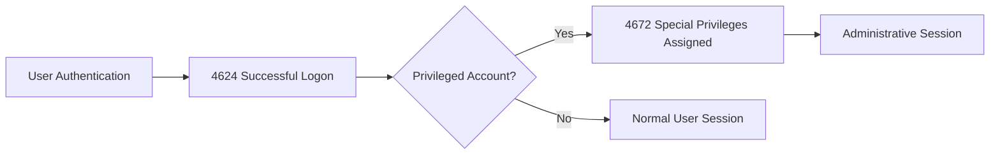
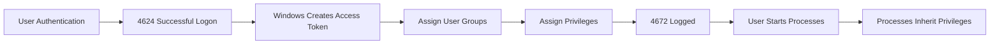
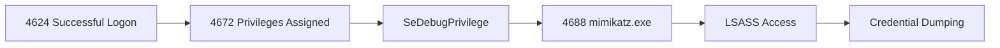
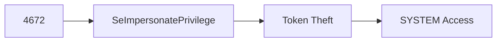
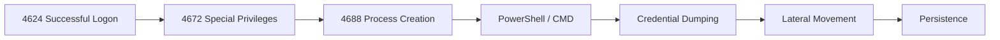

[⬅️ Previous: Event ID 4648 – Explicit Credentials](4648-explicit-credentials.md) | [🏠 Authentication Overview](../authentication.md) | [➡️ Next: Event ID 4768 – Kerberos TGT Request](4768-kerberos-tgt.md)

---

# Event ID 4672 – Special Privileges Assigned to New Logon


---

# Quick Facts

| Property | Value |
|----------|-------|
| **Event ID** | 4672 |
| **Category** | Authentication |
| **Log Source** | Windows Security Log |
| **Severity** | High |
| **Trigger** | Special privileges assigned to a newly authenticated logon session |
| **Typical Volume** | Low |
| **Detection Priority** | ⭐⭐⭐⭐⭐ |
| **Related Events** | 4624, 4648, 4688, 4697, 4768, 4769 |
| **Reading Time** | ~12 minutes |

---

# Table of Contents

- [Overview](#overview)
- [Why This Event Matters](#why-this-event-matters)
- [Event Information](#event-information)
- [Authentication Workflow](#authentication-workflow)
- [When Is Event ID 4672 Generated?](#when-is-event-id-4672-generated)
- [Who Normally Generates This Event?](#who-normally-generates-this-event)
- [Important Event Fields](#important-event-fields)
- [Example Windows Event](#example-windows-event)
- [Understanding the Example](#understanding-the-example)
- [Windows Privileges Explained](#windows-privileges-explained)
- [Privilege Abuse by Attackers](#privilege-abuse-by-attackers)
- [Common Attack Scenarios](#common-attack-scenarios)
- [Investigation Playbook](#investigation-playbook)
- [Detection Tips](#detection-tips)
- [Detection Logic](#detection-logic)
- [SIEM Queries](#splunk-queries)
- [MITRE ATT&CK Mapping](#mitre-attck-mapping)
- [Common False Positives](#common-false-positives)
- [Analyst Tips](#analyst-tips)
- [Related Event IDs](#related-event-ids)
- [Investigation Checklist](#investigation-checklist)
- [Key Takeaways](#key-takeaways)
- [References](#references)

---

# Overview

**Event ID 4672** is generated whenever Windows assigns **special administrative privileges** to a newly created logon session.

Unlike **Event ID 4624**, which simply records a successful authentication, Event ID **4672** indicates that the authenticated account has been granted one or more powerful Windows privileges capable of performing sensitive system operations.

These privileges are typically associated with:

- Local Administrators
- Domain Administrators
- SYSTEM
- Local Service
- Network Service
- TrustedInstaller
- Backup Operators
- Other highly privileged security principals

Because these privileges enable administrative control over a system, Event ID **4672** is considered one of the most valuable authentication events for SOC analysts, threat hunters, and incident responders.

> [!IMPORTANT]
> Event ID **4672** does **not** indicate malicious activity by itself. It simply means that Windows granted privileged rights to the authenticated security token. Analysts must determine whether the account, system, timing, and activity are expected.

---

# Why This Event Matters

Many post-exploitation techniques require administrative privileges.

Examples include:

- Credential Dumping
- LSASS Memory Access
- Token Impersonation
- Driver Loading
- Backup Abuse
- Registry Modification
- Security Log Manipulation
- Lateral Movement
- Privilege Escalation

A common attack sequence may appear as:

```text
4624
↓

4672
↓

4688

↓

Credential Dumping

↓

Lateral Movement
```

For this reason, Event ID **4672** is often one of the earliest indicators that a privileged account is being used.

---

# Event Information

| Property | Value |
|----------|-------|
| **Event ID** | 4672 |
| **Log Name** | Security |
| **Provider** | Microsoft-Windows-Security-Auditing |
| **Category** | Logon |
| **Trigger** | Assignment of special privileges |
| **Default Enabled** | Yes |

---

# Authentication Workflow

The following diagram illustrates where Event ID **4672** appears during a privileged authentication.



---

# When Is Event ID 4672 Generated?

Windows generates Event ID **4672** immediately after a successful logon whenever the newly created access token contains one or more **special privileges**.

Typical situations include:

- Administrator logs in locally.
- Domain Administrator authenticates.
- SYSTEM account starts a process.
- Scheduled Task runs as Administrator.
- Windows Service starts with elevated privileges.
- Backup software authenticates.
- Security software starts privileged processes.
- Remote administrator connects through RDP.

---

# Who Normally Generates This Event?

Legitimate sources include:

- Domain Administrators
- Local Administrators
- SYSTEM
- Local Service
- Network Service
- Backup Operators
- Enterprise management software
- Security monitoring tools
- Antivirus software
- Backup applications

> [!TIP]
> Event ID **4672** is expected on Domain Controllers because privileged accounts authenticate frequently.

---

# Important Event Fields

| Field | Description | Investigation Value |
|-------|-------------|--------------------|
| **SubjectUserSid** | Security Identifier (SID) | Identifies the account uniquely |
| **SubjectUserName** | Authenticated user | Primary account under investigation |
| **SubjectDomainName** | User domain | Distinguishes local vs domain accounts |
| **SubjectLogonId** | Logon session identifier | Correlate related authentication events |
| **PrivilegeList** | Assigned Windows privileges | Most valuable field in this event |

> [!TIP]
> The **PrivilegeList** field tells analysts exactly which Windows privileges were granted during logon and is the primary focus when investigating Event ID **4672**.

---

# Example Windows Event

```text
Event ID:
4672

Account Name:
Administrator

Account Domain:
CONTOSO

Logon ID:
0x3E7

Privileges:
SeDebugPrivilege
SeBackupPrivilege
SeRestorePrivilege
SeTakeOwnershipPrivilege
SeImpersonatePrivilege
```

---

# Understanding the Example

From this event we know:

| Observation | Interpretation |
|-------------|----------------|
| User | Administrator authenticated |
| Domain | CONTOSO |
| Session | Privileged logon session |
| Assigned Privileges | Administrative rights granted |
| Investigation Focus | Determine what occurred after authentication |

The next investigative step is to determine whether these privileges were used to perform administrative or potentially malicious actions.

Analysts should immediately correlate Event ID **4672** with:

- **4624** — Successful Logon
- **4688** — Process Creation
- **4697** — Service Installation
- **4698** — Scheduled Task Creation
- **4104** — PowerShell Script Block Logging

---

# Windows Privileges Explained

One of the most valuable fields in Event ID **4672** is the **PrivilegeList**.

Windows privileges define **what actions an authenticated account is allowed to perform** beyond standard user permissions.

These privileges are assigned to the **access token** created during logon and determine whether a process can perform sensitive operations such as debugging other processes, loading drivers, or taking ownership of protected objects.

> [!IMPORTANT]
> A privilege is **not** the same as a permission.
>
> - **Permissions** control access to specific objects (files, folders, registry keys, etc.).
> - **Privileges** grant system-wide capabilities that can affect the entire operating system.

---

# How Windows Privileges Work



Every process launched by that logon session inherits the privileges contained in the user's access token unless restricted by Windows security mechanisms.

---

# Common Windows Privileges

| Privilege | Purpose | Risk Level |
|-----------|---------|-----------|
| **SeDebugPrivilege** | Debug or access other processes | 🔴 Critical |
| **SeImpersonatePrivilege** | Impersonate another user's security context | 🔴 Critical |
| **SeBackupPrivilege** | Read protected files for backup | 🟠 High |
| **SeRestorePrivilege** | Restore protected files | 🟠 High |
| **SeTakeOwnershipPrivilege** | Take ownership of protected objects | 🟠 High |
| **SeLoadDriverPrivilege** | Load or unload kernel drivers | 🔴 Critical |
| **SeSecurityPrivilege** | Manage auditing and security logs | 🔴 Critical |
| **SeSystemEnvironmentPrivilege** | Modify firmware (UEFI/BIOS) variables | 🔴 Critical |
| **SeAssignPrimaryTokenPrivilege** | Replace process tokens | 🔴 Critical |
| **SeCreateTokenPrivilege** | Create security tokens | 🔴 Critical |

---

# Complete Privilege Reference

The **PrivilegeList** field in Event ID **4672** contains one or more Windows privileges assigned to the authenticated logon session.

Below are the most commonly observed privileges and why they matter during investigations.

| Privilege | Microsoft Description | Typical Usage | Security Risk |
|-----------|----------------------|---------------|---------------|
| **SeAssignPrimaryTokenPrivilege** | Replace a process-level token | Windows Services | 🔴 High |
| **SeAuditPrivilege** | Generate security audits | Windows auditing | 🟡 Low |
| **SeBackupPrivilege** | Back up files and directories | Backup software | 🟠 High |
| **SeChangeNotifyPrivilege** | Bypass traverse checking | Default Windows privilege | 🟢 Low |
| **SeCreateGlobalPrivilege** | Create global objects | Terminal Services | 🟡 Low |
| **SeCreatePagefilePrivilege** | Create pagefile | Operating System | 🟢 Low |
| **SeCreatePermanentPrivilege** | Create permanent shared objects | Windows kernel | 🔴 High |
| **SeCreateSymbolicLinkPrivilege** | Create symbolic links | Developers / Administrators | 🟠 Medium |
| **SeCreateTokenPrivilege** | Create security tokens | Local Security Authority | 🔴 Critical |
| **SeDebugPrivilege** | Debug programs | Administrators | 🔴 Critical |
| **SeEnableDelegationPrivilege** | Enable delegation for users/computers | Domain Controllers | 🔴 Critical |
| **SeImpersonatePrivilege** | Impersonate a client | Services | 🔴 Critical |
| **SeIncreaseBasePriorityPrivilege** | Increase process priority | System performance | 🟡 Low |
| **SeIncreaseQuotaPrivilege** | Adjust process memory quotas | Windows Services | 🟡 Low |
| **SeLoadDriverPrivilege** | Load and unload device drivers | Device Management | 🔴 Critical |
| **SeMachineAccountPrivilege** | Add computers to a domain | Domain Administration | 🟠 Medium |
| **SeManageVolumePrivilege** | Perform volume maintenance | Disk Management | 🟠 Medium |
| **SeProfileSingleProcessPrivilege** | Profile a process | Performance analysis | 🟡 Low |
| **SeRelabelPrivilege** | Modify mandatory integrity labels | Security management | 🟠 Medium |
| **SeRemoteShutdownPrivilege** | Shut down a remote system | Administrators | 🟠 Medium |
| **SeRestorePrivilege** | Restore files and directories | Backup software | 🟠 High |
| **SeSecurityPrivilege** | Manage auditing and security log | Security administrators | 🔴 Critical |
| **SeShutdownPrivilege** | Shut down the local system | Administrators | 🟡 Low |
| **SeSyncAgentPrivilege** | Synchronize directory service data | Active Directory | 🟠 Medium |
| **SeSystemEnvironmentPrivilege** | Modify firmware environment values | Firmware management | 🔴 Critical |
| **SeSystemProfilePrivilege** | Profile system performance | Performance monitoring | 🟡 Low |
| **SeSystemtimePrivilege** | Change system time | Time synchronization | 🟡 Low |
| **SeTakeOwnershipPrivilege** | Take ownership of files or objects | Administrators | 🟠 High |
| **SeTcbPrivilege** | Act as part of the operating system | Local Security Authority | 🔴 Critical |
| **SeTimeZonePrivilege** | Change time zone | Administrators | 🟢 Low |
| **SeTrustedCredManAccessPrivilege** | Access Credential Manager | Credential Manager | 🔴 Critical |
| **SeUndockPrivilege** | Remove computer from docking station | Legacy hardware | 🟢 Low |

---

> [!NOTE]
> Not every privileged account receives every privilege. The privileges assigned depend on the account type, group memberships, local security policy, and system configuration.

---

# Most Dangerous Privileges for Defenders

SOC analysts should pay particular attention to the following privileges because they are frequently abused during post-exploitation.

| Privilege | Why It Matters |
|-----------|----------------|
| **SeDebugPrivilege** | Access LSASS memory and dump credentials. |
| **SeImpersonatePrivilege** | Used in Potato-style privilege escalation attacks. |
| **SeBackupPrivilege** | Read protected files such as SAM and NTDS.dit. |
| **SeRestorePrivilege** | Replace protected system files. |
| **SeTakeOwnershipPrivilege** | Gain control over protected resources. |
| **SeLoadDriverPrivilege** | Load vulnerable or malicious kernel drivers. |
| **SeSecurityPrivilege** | Modify auditing and security logging. |
| **SeCreateTokenPrivilege** | Create forged security tokens. |
| **SeTcbPrivilege** | One of the most powerful Windows privileges; rarely assigned outside core system components. |

> [!WARNING]
> A privileged account possessing **SeDebugPrivilege**, **SeImpersonatePrivilege**, or **SeTcbPrivilege** deserves immediate attention if followed by process creation, PowerShell execution, or credential access activity.
# Privilege Abuse by Attackers

| Privilege | Legitimate Use | Common Attacker Abuse |
|-----------|----------------|-----------------------|
| **SeDebugPrivilege** | Debug applications | Dump LSASS credentials |
| **SeImpersonatePrivilege** | Windows Services | Token impersonation / Potato exploits |
| **SeBackupPrivilege** | Backup operations | Read SAM & NTDS.dit |
| **SeRestorePrivilege** | Restore backups | Replace protected system files |
| **SeTakeOwnershipPrivilege** | Recover inaccessible files | Access restricted objects |
| **SeLoadDriverPrivilege** | Install drivers | Load malicious or vulnerable drivers |
| **SeSecurityPrivilege** | Audit management | Disable or manipulate auditing |
| **SeCreateTokenPrivilege** | Authentication subsystem | Create forged security tokens |

---

# Common Attack Scenarios

## Scenario 1 — Credential Dumping



Indicators:

- Administrator account
- SeDebugPrivilege assigned
- Access to LSASS
- Security tool alerts

---

## Scenario 2 — Token Impersonation



Common techniques:

- Juicy Potato
- Rogue Potato
- PrintSpoofer
- GodPotato

---

## Scenario 3 — Backup Privilege Abuse

```text
4672

↓

SeBackupPrivilege

↓

Read SAM

↓

Read SYSTEM

↓

Offline Password Extraction
```

Questions:

- Was backup software involved?
- Was NTDS.dit accessed?
- Was the account expected?

---

## Scenario 4 — Driver Loading

```text
4672

↓

SeLoadDriverPrivilege

↓

Driver Installed

↓

Kernel Access
```

Potential impact:

- Disable EDR
- Hide malware
- Kernel persistence

---

# Investigation Playbook

When investigating Event ID **4672**:

1. Identify the authenticated account.
2. Determine whether the account is expected.
3. Review the assigned privileges.
4. Correlate with Event ID **4624**.
5. Review process creation (4688).
6. Identify PowerShell activity (4104).
7. Check service creation (4697).
8. Review scheduled tasks (4698).
9. Identify network connections.
10. Build a timeline.
11. Determine whether privileges were actually used.

---

# Detection Tips

Look for:

- Domain Administrator logons on user workstations.
- SeDebugPrivilege followed by LSASS access.
- SeImpersonatePrivilege followed by privilege escalation.
- SeLoadDriverPrivilege followed by driver installation.
- Privileged accounts authenticating outside business hours.
- Service accounts logging into interactive sessions.
- Administrative sessions followed immediately by PowerShell or command execution.

> [!TIP]
> Event ID **4672** becomes significantly more valuable when correlated with **4688**, **4697**, **4698**, and **4104**.

---

# Detection Logic



---
# Splunk Queries

## Find All Privileged Logons

```spl
index=wineventlog EventCode=4672
| table _time SubjectUserName host PrivilegeList
```

---

## Top Privileged Accounts

```spl
index=wineventlog EventCode=4672
| stats count by SubjectUserName
| sort -count
```

---

## Privileged Logons by Host

```spl
index=wineventlog EventCode=4672
| stats count by host
| sort -count
```

---

## Privileged Logons Outside Business Hours

```spl
index=wineventlog EventCode=4672
| eval Hour=strftime(_time,"%H")
| where Hour<8 OR Hour>18
| table _time SubjectUserName host Hour
```

---

## Privileged Logons Followed by Process Creation

```spl
index=wineventlog (EventCode=4672 OR EventCode=4688)
| transaction Subject_Logon_ID maxspan=5m
```

---

## Privileged Logons from Workstations

```spl
index=wineventlog EventCode=4672
host!="DC*"
| table _time SubjectUserName host
```

---

# Microsoft Sentinel (KQL)

## All Privileged Logons

```kusto
SecurityEvent
| where EventID == 4672
| project TimeGenerated, SubjectUserName, Computer, PrivilegeList
| order by TimeGenerated desc
```

---

## Top Privileged Accounts

```kusto
SecurityEvent
| where EventID == 4672
| summarize Count=count() by SubjectUserName
| order by Count desc
```

---

## Privileged Logons Outside Business Hours

```kusto
SecurityEvent
| where EventID == 4672
| extend Hour = datetime_part("Hour", TimeGenerated)
| where Hour < 8 or Hour > 18
```

---

## Correlate 4624 and 4672

```kusto
SecurityEvent
| where EventID in (4624,4672)
| order by TimeGenerated desc
```

---

## Correlate 4672 and 4688

```kusto
SecurityEvent
| where EventID in (4672,4688)
| order by TimeGenerated desc
```

---

# Sigma Rule Example

```yaml
title: Privileged Logon Detected
id: 4672-example
status: experimental

description: Detects privileged Windows logons.

logsource:
  product: windows
  service: security

detection:
  selection:
    EventID: 4672

condition: selection

falsepositives:
  - Domain administrators
  - Local administrators
  - Backup software
  - Security software

level: high
```

> [!NOTE]
> In production environments, Sigma rules should include allowlists, thresholds, host filtering, and account exclusions to reduce false positives.

---

# MITRE ATT&CK Mapping

| Technique | ID | Description |
|-----------|----|-------------|
| Valid Accounts | T1078 | Privileged account authentication |
| Access Token Manipulation | T1134 | Abuse of security tokens |
| OS Credential Dumping | T1003 | Dump credentials after privileged logon |
| Command and Scripting Interpreter | T1059 | Execute administrative commands |
| Remote Services | T1021 | Lateral movement after privileged authentication |

---

# Common False Positives

Event ID **4672** is expected in many enterprise environments.

Common legitimate causes include:

- Domain Administrator logons.
- Local Administrator logons.
- Windows startup.
- SYSTEM account activity.
- Backup software.
- Endpoint security products.
- Enterprise management tools (SCCM, Intune, etc.).
- Scheduled maintenance.
- Help Desk administrative activity.

> [!IMPORTANT]
> A single Event ID **4672** should **never** be treated as malicious without additional context.

---

# Analyst Tips

> [!TIP]
> Prioritize Event ID **4672** occurring on user workstations rather than domain controllers.

> [!TIP]
> Review the **PrivilegeList** to understand what capabilities were granted.

> [!TIP]
> Correlate privileged logons with **4688** to determine what processes were launched.

> [!TIP]
> Pay close attention to **SeDebugPrivilege** and **SeImpersonatePrivilege**, as they are frequently abused during post-exploitation.

> [!TIP]
> A privileged logon followed by PowerShell execution deserves immediate investigation.

> [!TIP]
> Service accounts generating interactive privileged logons are uncommon and should be reviewed.

---

# Related Event IDs

| Event ID | Description | Why Correlate? |
|-----------|-------------|----------------|
| [4624](4624-successful-logon.md) | Successful Logon | Identify the authentication that created the privileged session |
| [4648](4648-explicit-credentials.md) | Explicit Credentials | Determine whether alternate credentials were supplied |
| 4688 | Process Creation | Identify processes launched with elevated privileges |
| 4697 | Service Installed | Detect persistence using services |
| 4698 | Scheduled Task Created | Detect persistence through scheduled tasks |
| 4768 | Kerberos TGT Request | Review Kerberos authentication |
| 4769 | Kerberos Service Ticket | Track service authentication |
| 4104 | PowerShell Script Block Logging | Detect PowerShell activity after privileged logon |
| 1102 | Audit Log Cleared | Detect possible anti-forensics |

# Related Articles

- [Windows Privileges](../windows-internals/windows-privileges.md)
- [Access Tokens](../windows-internals/access-tokens.md)
- [Credential Dumping](../attack-techniques/credential-dumping.md)
---

# Investigation Checklist

Use the following checklist when investigating Event ID **4672**:

- [ ] Identify the authenticated account.
- [ ] Determine whether the account is privileged.
- [ ] Review the assigned privileges.
- [ ] Correlate with Event ID **4624**.
- [ ] Review Event ID **4688**.
- [ ] Check PowerShell activity (4104).
- [ ] Review service installation events (4697).
- [ ] Review scheduled task creation (4698).
- [ ] Identify network connections.
- [ ] Determine whether the activity is expected.
- [ ] Build a complete attack timeline.

---

# Key Takeaways

- Event ID **4672** indicates that Windows assigned **special privileges** to a newly authenticated logon session.
- It is one of the highest-value authentication events for SOC analysts.
- The **PrivilegeList** field is the most important field to review.
- Privileges such as **SeDebugPrivilege** and **SeImpersonatePrivilege** are commonly abused during post-exploitation.
- Event ID **4672** should always be correlated with **4624**, **4688**, **4697**, **4698**, and **4104**.
- Context determines whether a privileged logon is expected or suspicious.

---

# References

- Microsoft Learn – Windows Security Auditing
- Microsoft Security Auditing Documentation
- Ultimate Windows Security Encyclopedia
- MITRE ATT&CK Framework
- Sigma Project
- NIST SP 800-61 Rev. 2 – Computer Security Incident Handling Guide
- Microsoft Privilege Constants Documentation

---

## Continue Reading

- [⬅️ Event ID 4648 – Explicit Credentials](4648-explicit-credentials.md)
- [🏠 Authentication Overview](../authentication.md)
- [➡️ Event ID 4768 – Kerberos Authentication Ticket (TGT) Requested](4768-kerberos-tgt.md)
