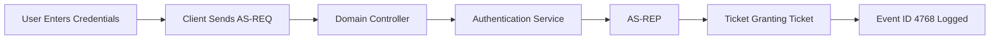
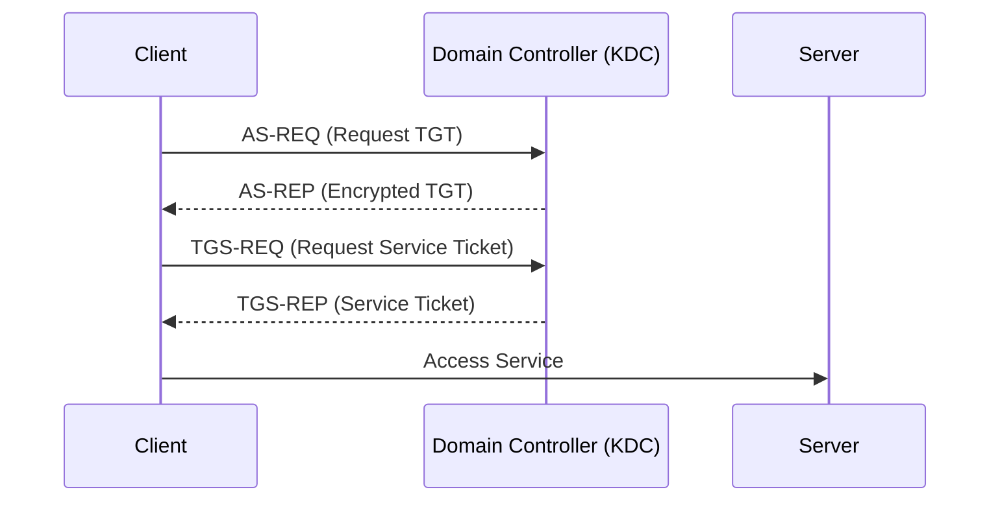
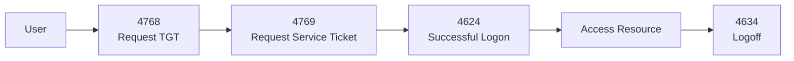
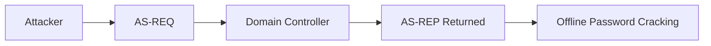
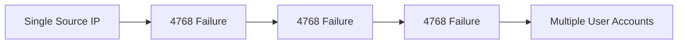
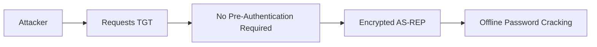
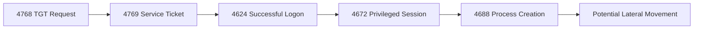

[⬅️ Previous: Event ID 4672 – Special Privileges Assigned](4672-special-privileges.md) | [🏠 Authentication Overview](../authentication.md) | [➡️ Next: Event ID 4769 – Kerberos Service Ticket](4769-service-ticket.md)

---

# Event ID 4768 – A Kerberos Authentication Ticket (TGT) Was Requested


---

# Quick Facts

| Property | Value |
|----------|--------|
| Event ID | 4768 |
| Category | Authentication |
| Log Source | Windows Security Log |
| Severity | Informational |
| Trigger | Kerberos TGT Request |
| Logged On | Domain Controller |
| Detection Priority | ⭐⭐⭐⭐ |
| Related Events | 4769, 4771, 4624 |
| Reading Time | ~12 Minutes |

---

# Table of Contents

- [Overview](#overview)
- [Why This Event Matters](#why-this-event-matters)
- [Event Information](#event-information)
- [What Is Kerberos?](#what-is-kerberos)
- [Kerberos Components](#kerberos-components)
- [Authentication Workflow](#authentication-workflow)
- [What Is a TGT?](#what-is-a-tgt)
- [When Is Event ID 4768 Generated?](#when-is-event-id-4768-generated)
- [Important Event Fields](#important-event-fields)
- [Example Windows Event](#example-windows-event)
- [Understanding the Example](#understanding-the-example)
- [AS-REQ and AS-REP Explained](#as-req-and-as-rep-explained)
- [Common Attack Scenarios](#common-attack-scenarios)
- [Investigation Playbook](#investigation-playbook)
- [Detection Tips](#detection-tips)
- [Detection Logic](#detection-logic)
- [SIEM Queries](#siem-queries)
- [MITRE ATT&CK Mapping](#mitre-attck-mapping)
- [Common False Positives](#common-false-positives)
- [Analyst Tips](#analyst-tips)
- [Related Event IDs](#related-event-ids)
- [Investigation Checklist](#investigation-checklist)
- [Key Takeaways](#key-takeaways)
- [References](#references)

---

# Overview

**Event ID 4768** is generated when a user, computer, or service account requests a **Kerberos Ticket Granting Ticket (TGT)** from a Domain Controller.

This event is logged on the **Domain Controller**, not on the client system.

A Ticket Granting Ticket is the first ticket issued during the Kerberos authentication process and allows the user to request additional service tickets without repeatedly sending credentials across the network.

Because almost every Active Directory authentication begins with a TGT request, Event ID **4768** is one of the most important events for monitoring domain authentication activity.

> [!IMPORTANT]
> Event ID 4768 indicates that a Kerberos authentication request occurred. It does **not** necessarily mean that the user successfully accessed a resource.

---

# Why This Event Matters

Kerberos is the primary authentication protocol used in Active Directory environments.

Monitoring Event ID 4768 helps security teams:

- Track domain authentication activity.
- Identify unusual account behavior.
- Detect password spraying.
- Detect AS-REP Roasting activity.
- Investigate account compromise.
- Trace lateral movement.
- Build authentication timelines.

A typical Kerberos authentication sequence appears as:

```text
4768
↓

4769
↓

4624
```

Meaning:

```text
Request TGT

↓

Request Service Ticket

↓

Access Resource
```

Understanding Event ID 4768 is essential for understanding how authentication occurs inside Active Directory.

---

# Event Information

| Property | Value |
|----------|--------|
| Event ID | 4768 |
| Log Name | Security |
| Provider | Microsoft-Windows-Security-Auditing |
| Category | Kerberos Authentication |
| Trigger | TGT Request |
| Logged On | Domain Controller |
| Default Enabled | Yes |

---

# What Is Kerberos?

Kerberos is a ticket-based authentication protocol used by Microsoft Active Directory.

Instead of repeatedly transmitting passwords across the network, Kerberos uses cryptographic tickets to prove identity.

Benefits include:

- Mutual authentication
- Strong encryption
- Reduced password exposure
- Single Sign-On (SSO)
- Centralized authentication

---

# Kerberos Components

| Component | Purpose |
|------------|---------|
| Client | User or system requesting access |
| Domain Controller | Processes Kerberos requests |
| KDC | Key Distribution Center |
| Authentication Service (AS) | Issues TGTs |
| Ticket Granting Service (TGS) | Issues Service Tickets |
| Service | Resource being accessed |

> [!TIP]
> The KDC, Authentication Service, and Ticket Granting Service all reside on the Domain Controller.

---

# Authentication Workflow

The following diagram shows where Event ID 4768 occurs within Kerberos authentication.



---

# What Is a TGT?

A **Ticket Granting Ticket (TGT)** is a Kerberos ticket issued after successful authentication.

The TGT allows the client to request service tickets without re-entering credentials.

Think of it as a temporary proof of identity.

Without a valid TGT:

- Users cannot request service tickets.
- Users cannot access Kerberos-protected resources.
- Single Sign-On will not function properly.

---

# When Is Event ID 4768 Generated?

Windows logs Event ID 4768 whenever a client requests a Ticket Granting Ticket.

Common scenarios include:

- User logon.
- Computer startup.
- Service account authentication.
- Scheduled task execution.
- Remote Desktop authentication.
- Domain resource access.
- Kerberos ticket renewal.

> [!NOTE]
> Event ID 4768 may be generated multiple times during a user's workday as tickets expire and renew.

---

# Important Event Fields

| Field | Description | Investigation Value |
|----------|-------------|--------------------|
| Account Name | User requesting the ticket | Primary account |
| Client Address | Source IP address | Identify origin |
| Ticket Options | Kerberos ticket flags | Authentication details |
| Result Code | Success or failure | Authentication outcome |
| Ticket Encryption Type | Encryption used | Security analysis |
| Pre-Authentication Type | Authentication method | AS-REP Roasting detection |
| Service Name | krbtgt account | TGT issuance |

---

# Example Windows Event

```text
Event ID: 4768

Account Name:
jdoe

Service Name:
krbtgt

Client Address:
192.168.1.50

Ticket Encryption Type:
0x12

Result Code:
0x0

Pre-Authentication Type:
2
```

---

# Understanding the Example

From the event above we know:

| Observation | Meaning |
|-------------|----------|
| Account | jdoe requested authentication |
| Service | krbtgt issued the ticket |
| IP Address | Request originated from 192.168.1.50 |
| Result Code 0x0 | Authentication succeeded |
| Pre-Authentication Type 2 | Standard Kerberos pre-authentication |

The next event to investigate would typically be **Event ID 4769**, where the client requests a service ticket.

---

# AS-REQ and AS-REP Explained

Kerberos authentication begins with a conversation between the client and the **Authentication Service (AS)** running on the Domain Controller.

The client first requests a **Ticket Granting Ticket (TGT)** by sending an **Authentication Service Request (AS-REQ)**.

If the user's credentials are valid, the Domain Controller responds with an **Authentication Service Reply (AS-REP)** containing the encrypted TGT.



> [!TIP]
> Event ID **4768** corresponds to the **AS-REQ / AS-REP** portion of the Kerberos authentication process.

---

# Kerberos Authentication Lifecycle

The complete Kerberos authentication process consists of four major stages.

| Step | Event | Description |
|------|-------|-------------|
| 1 | **4768** | Client requests a Ticket Granting Ticket (TGT) |
| 2 | **4769** | Client requests a Service Ticket (TGS) |
| 3 | **4624** | Successful logon to the requested service |
| 4 | **4634** | User logs off |



---

# Kerberos Pre-Authentication

Before issuing a TGT, the Domain Controller normally requires **Kerberos Pre-Authentication**.

This mechanism proves that the client already knows the account password before the Domain Controller generates a ticket.

Benefits include:

- Prevents anonymous ticket requests.
- Reduces password guessing attacks.
- Protects against offline password cracking.
- Improves authentication security.

---

# What Is AS-REP Roasting?

AS-REP Roasting is an attack against Active Directory accounts that **do not require Kerberos pre-authentication**.

If pre-authentication is disabled, an attacker can request an encrypted authentication response without first proving knowledge of the user's password.

The attacker can then attempt to crack the encrypted response offline.



> [!WARNING]
> Accounts configured with **"Do not require Kerberos pre-authentication"** are vulnerable to **AS-REP Roasting**.

---

# Common Result Codes

The **Result Code** field indicates whether the TGT request succeeded or failed.

| Result Code | Meaning | Investigation Notes |
|-------------|---------|---------------------|
| **0x0** | Success | Authentication succeeded |
| **0x6** | Client not found | Username may not exist |
| **0x12** | Client credentials revoked | Account disabled or locked |
| **0x17** | Password expired | Verify account status |
| **0x18** | Pre-authentication failed | Incorrect password or password spray |
| **0x19** | Additional pre-authentication required | Usually normal |
| **0x20** | Ticket expired | Ticket renewal required |

> [!TIP]
> Multiple **0x18** failures from a single IP address often indicate password spraying or brute-force activity.

---

# Ticket Encryption Types

Modern Windows environments use strong encryption algorithms for Kerberos tickets.

| Encryption Type | Description | Security |
|-----------------|-------------|----------|
| **0x11** | AES-128 | Good |
| **0x12** | AES-256 | Recommended |
| **0x17** | RC4-HMAC | Legacy |
| **0x03** | DES-CBC-MD5 | Weak (Deprecated) |

> [!WARNING]
> Frequent use of **RC4 (0x17)** or **DES** in modern Active Directory environments may indicate legacy systems or insecure configurations.

---

# Common Attack Scenarios

## Scenario 1 — Password Spraying



Indicators:

- Same source IP
- Many usernames
- Result Code **0x18**
- Short time window

---

## Scenario 2 — AS-REP Roasting



Indicators:

- Accounts without pre-authentication.
- Large numbers of TGT requests.
- Requests targeting service accounts.

---

## Scenario 3 — Suspicious Domain Authentication

```text
4768

↓

4769

↓

4624

↓

4672
```

Possible interpretation:

- User authenticated successfully.
- Requested service access.
- Logged on.
- Received administrative privileges.

Further investigation should determine whether this activity is expected.

---

# Investigation Playbook

When investigating Event ID **4768**:

1. Identify the requesting account.
2. Verify the source IP address.
3. Review the Result Code.
4. Review the encryption type.
5. Check whether pre-authentication was required.
6. Correlate with Event ID **4769**.
7. Correlate with Event ID **4624**.
8. Determine whether privileged access followed.
9. Build an authentication timeline.
10. Determine whether the activity is expected or suspicious.

---

# Detection Tips

Look for:

- Large numbers of TGT requests.
- Multiple Result Code **0x18** failures.
- Requests from unusual countries or networks.
- Legacy RC4 encryption usage.
- Accounts without Kerberos pre-authentication.
- Authentication attempts outside business hours.
- Unusual service account activity.

> [!TIP]
> Event ID **4768** becomes significantly more valuable when correlated with **4769**, **4624**, and **4672**.

---

# Detection Logic



---
# SIEM Queries

## Splunk

### Find All Kerberos TGT Requests

```spl
index=wineventlog EventCode=4768
| table _time Account_Name Client_Address Ticket_Encryption_Type Result_Code
```

---

### Top Accounts Requesting TGTs

```spl
index=wineventlog EventCode=4768
| stats count by Account_Name
| sort -count
```

---

### Top Source IP Addresses

```spl
index=wineventlog EventCode=4768
| stats count by Client_Address
| sort -count
```

---

### Detect Possible Password Spraying

```spl
index=wineventlog EventCode=4768 Result_Code=0x18
| bucket _time span=5m
| stats dc(Account_Name) as TargetedUsers count by Client_Address _time
| where TargetedUsers > 10
```

---

### Detect Legacy RC4 Usage

```spl
index=wineventlog EventCode=4768 Ticket_Encryption_Type=0x17
| table _time Account_Name Client_Address host
```

---

# Microsoft Sentinel (KQL)

## All Kerberos TGT Requests

```kusto
SecurityEvent
| where EventID == 4768
| project TimeGenerated, Account, Computer, IpAddress, TicketEncryptionType, ResultCode
| order by TimeGenerated desc
```

---

## Top Source IP Addresses

```kusto
SecurityEvent
| where EventID == 4768
| summarize Requests=count() by IpAddress
| order by Requests desc
```

---

## Detect Password Spraying

```kusto
SecurityEvent
| where EventID == 4768
| where ResultCode == "0x18"
| summarize TargetedUsers=dcount(Account) by IpAddress, bin(TimeGenerated,5m)
| where TargetedUsers > 10
```

---

## Detect RC4 Encryption Usage

```kusto
SecurityEvent
| where EventID == 4768
| where TicketEncryptionType == "0x17"
```

---

## Correlate 4768 and 4769

```kusto
SecurityEvent
| where EventID in (4768,4769)
| order by TimeGenerated asc
```

---

# Sigma Rule Example

```yaml
title: Kerberos TGT Request
id: 4768-example
status: experimental

description: Detects Kerberos Ticket Granting Ticket requests.

logsource:
  product: windows
  service: security

detection:
  selection:
    EventID: 4768

condition: selection

falsepositives:
  - Normal domain authentication
  - Computer startup
  - Service account authentication

level: low
```

> [!NOTE]
> In production, Sigma rules should include thresholds, filtering, and correlation with related authentication events to reduce noise.

---

# MITRE ATT&CK Mapping

| Technique | ID | Description |
|-----------|----|-------------|
| Steal or Forge Kerberos Tickets | **T1558** | Abuse of Kerberos authentication |
| Password Spraying | **T1110.003** | Single password used against many accounts |
| Brute Force | **T1110** | Password guessing attempts |
| Valid Accounts | **T1078** | Successful domain authentication |
| Remote Services | **T1021** | Lateral movement after authentication |

---

# Common False Positives

Event ID **4768** is one of the most common authentication events in Active Directory environments.

Legitimate causes include:

- User logon.
- Computer startup.
- Domain logon.
- Scheduled task execution.
- Service account authentication.
- Ticket renewal.
- Group Policy processing.
- Domain resource access.

> [!IMPORTANT]
> A high volume of Event ID **4768** entries is normal in enterprise environments. Focus on unusual patterns rather than individual events.

---

# Analyst Tips

> [!TIP]
> Always investigate **Result Code** before assuming malicious activity.

> [!TIP]
> Correlate **4768 → 4769 → 4624** to understand the full Kerberos authentication flow.

> [!TIP]
> Review **Ticket Encryption Type**. Modern environments should primarily use **AES (0x11 or 0x12)**.

> [!TIP]
> Frequent **0x18 (Pre-authentication failed)** results may indicate password spraying or brute-force attacks.

> [!TIP]
> Watch for accounts configured with **"Do not require Kerberos pre-authentication"**, as they are vulnerable to **AS-REP Roasting**.

---

# Related Event IDs

| Event ID | Description | Why Correlate? |
|-----------|-------------|----------------|
| [4624](4624-successful-logon.md) | Successful Logon | Confirm successful authentication to a system |
| [4625](4625-failed-logon.md) | Failed Logon | Compare Kerberos failures with local logon failures |
| [4672](4672-special-privileges.md) | Special Privileges Assigned | Determine whether privileged access followed authentication |
| [4769](4769-service-ticket.md) | Kerberos Service Ticket Requested | Track the next stage of Kerberos authentication |
| [4771](4771-kerberos-failure.md) | Kerberos Pre-Authentication Failed | Investigate Kerberos authentication failures |
| [4776](4776-ntlm-authentication.md) | NTLM Authentication | Determine whether NTLM was used instead of Kerberos |
| 4688 | Process Creation | Identify processes launched after authentication |
| 4104 | PowerShell Script Block Logging | Detect PowerShell activity after logon |

---

# Investigation Checklist

Use the following checklist when investigating Event ID **4768**:

- [ ] Identify the requesting account.
- [ ] Verify the source IP address.
- [ ] Review the Result Code.
- [ ] Review the Ticket Encryption Type.
- [ ] Determine whether Kerberos pre-authentication was required.
- [ ] Correlate with Event ID **4769**.
- [ ] Correlate with Event ID **4624**.
- [ ] Determine whether privileged access followed (4672).
- [ ] Review process creation (4688).
- [ ] Build a complete authentication timeline.

---

# Key Takeaways

- Event ID **4768** records **Ticket Granting Ticket (TGT)** requests.
- It is the **first step** in Kerberos authentication.
- This event is logged on the **Domain Controller**.
- Monitoring Result Codes helps detect authentication failures.
- Reviewing Ticket Encryption Types helps identify weak or legacy configurations.
- Correlate Event ID **4768** with **4769**, **4624**, and **4672** to understand the complete authentication chain.
- Accounts without Kerberos pre-authentication enabled are vulnerable to **AS-REP Roasting**.

---

# References

- Microsoft Learn – Kerberos Authentication Overview
- Microsoft Windows Security Auditing Documentation
- MITRE ATT&CK Framework
- Sigma Project
- Ultimate Windows Security
- RFC 4120 – The Kerberos Network Authentication Service (V5)
- NIST SP 800-63B – Digital Identity Guidelines

---

## Continue Reading

- [⬅️ Event ID 4672 – Special Privileges Assigned](4672-special-privileges.md)
- [🏠 Authentication Overview](../authentication.md)
- [➡️ Event ID 4769 – Kerberos Service Ticket Requested](4769-service-ticket.md)
