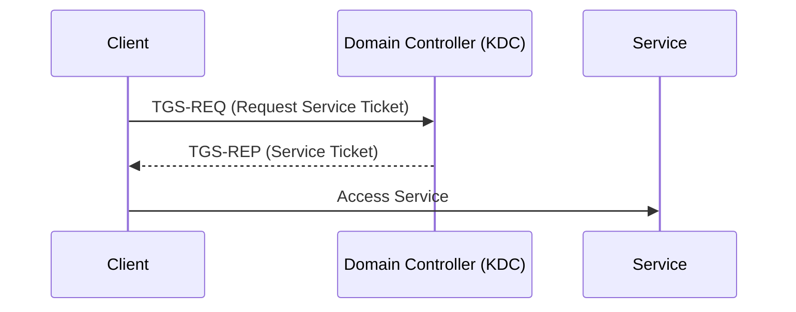
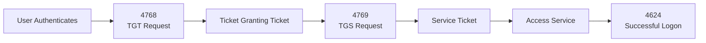
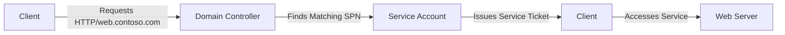
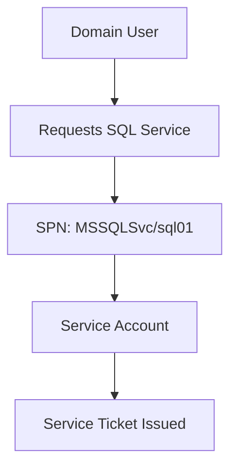
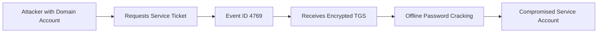
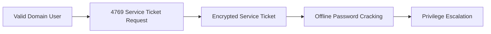
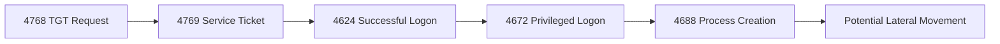

[⬅️ Previous: Event ID 4768 – Kerberos TGT Request](4768-kerberos-tgt.md) | [🏠 Authentication Overview](../authentication.md) | [➡️ Next: Event ID 4771 – Kerberos Pre-Authentication Failed](4771-kerberos-failure.md)

---

# Event ID 4769 – A Kerberos Service Ticket Was Requested


> 📖 **Reading Time:** 12 minutes

> **Category:** Authentication  
> **Log Source:** Windows Security Log (Domain Controller)  
> **Severity:** Informational (May indicate malicious activity depending on context)  
> **MITRE ATT&CK:** T1558 – Steal or Forge Kerberos Tickets

---

# Table of Contents

- [Overview](#overview)
- [Why This Event Matters](#why-this-event-matters)
- [Event Information](#event-information)
- [Kerberos Service Ticket Workflow](#kerberos-service-ticket-workflow)
- [What Is a Service Ticket?](#what-is-a-service-ticket)
- [Service Principal Names (SPNs)](#service-principal-names-spns)
- [Service Accounts](#service-accounts)
- [Ticket Encryption Types](#ticket-encryption-types)
- [Common Attack Scenarios](#common-attack-scenarios)
- [Investigation Playbook](#investigation-playbook)
- [Detection Tips](#detection-tips)
- [SIEM Queries](#siem-queries)
- [MITRE ATT&CK Mapping](#mitre-attck-mapping)
- [Common False Positives](#common-false-positives)
- [Analyst Tips](#analyst-tips)
- [Related Event IDs](#related-event-ids)
- [Related Articles](#related-articles)
- [Investigation Checklist](#investigation-checklist)
- [Key Takeaways](#key-takeaways)
- [References](#references)

---

# Overview

**Event ID 4769** is generated whenever a client requests a **Kerberos Service Ticket (TGS)** from the **Key Distribution Center (KDC)** on a Domain Controller.

Unlike **Event ID 4768**, which records the request for a **Ticket Granting Ticket (TGT)**, Event ID **4769** records the request for access to a **specific service**, such as a file server, SQL Server, web application, or domain service.

Because every Kerberos-authenticated service requires a Service Ticket, Event ID **4769** is one of the most valuable Windows Security Events for monitoring lateral movement, service account abuse, and Kerberoasting attacks.



---

# Why This Event Matters

A Kerberos Service Ticket represents authorization to access a specific service within an Active Directory environment.

Security analysts use Event ID **4769** to answer questions such as:

- Which service was requested?
- Which account requested access?
- Was the request expected?
- Which encryption type was used?
- Was the request made by a privileged account?
- Does the Service Principal Name (SPN) appear legitimate?
- Could the request indicate Kerberoasting?

Unlike Event ID **4768**, which simply confirms that a user authenticated to the domain, Event ID **4769** reveals **what the authenticated user attempted to access**.

> [!IMPORTANT]
> Event ID **4769** is one of the primary events used to detect **Kerberoasting**, where attackers request service tickets for accounts with Service Principal Names (SPNs) and attempt to crack them offline.

---

# Event Information

| Property | Value |
|----------|-------|
| Event ID | 4769 |
| Log Name | Security |
| Source | Microsoft Windows Security Auditing |
| Category | Kerberos Authentication |
| Trigger | Kerberos Service Ticket Request (TGS-REQ) |
| Logged On | Domain Controller |
| Default Enabled | Yes |

---

# Kerberos Service Ticket Workflow

After obtaining a **Ticket Granting Ticket (TGT)** through Event ID **4768**, the client requests a **Service Ticket** for the resource it wants to access.



> [!TIP]
> Event ID **4768** and **4769** are normally observed together during Kerberos authentication. Investigating them together provides a complete picture of how a user authenticated and which services they accessed.

---

# What Is a Service Ticket?

A **Kerberos Service Ticket**, also known as a **Ticket Granting Service (TGS) Ticket**, is a temporary credential that allows a user or computer to access a specific network service without sending the account password.

Each Service Ticket is issued for **one service only**.

Examples include:

- File Servers
- SQL Servers
- Web Servers
- Remote Desktop Services
- LDAP
- Domain Controllers
- Print Servers

Because Service Tickets are encrypted using the service account's secret, attackers often target them during **Kerberoasting** attacks.

---
# Service Principal Names (SPNs)

A **Service Principal Name (SPN)** is a unique identifier that tells Kerberos which service a client wants to access.

Think of an SPN as the **identity of a service** within Active Directory. When a client requests access to a service, it includes the SPN in the **Ticket Granting Service Request (TGS-REQ)**. The Domain Controller uses the SPN to locate the correct service account and issue the appropriate Service Ticket.

> [!IMPORTANT]
> Every Kerberos-enabled service must have a correctly configured **Service Principal Name (SPN)**. Without a valid SPN, Kerberos authentication cannot locate the target service.

## Common SPN Examples

| Service | Example SPN |
|----------|-------------|
| File Server | `cifs/fileserver.contoso.com` |
| Web Server | `HTTP/web.contoso.com` |
| SQL Server | `MSSQLSvc/sql01.contoso.com:1433` |
| LDAP | `LDAP/dc01.contoso.com` |
| Remote Desktop | `TERMSRV/server01.contoso.com` |
| Exchange | `HOST/mail.contoso.com` |



> [!TIP]
> Security analysts should review unusual or rarely used SPNs. Attackers often request tickets for privileged service accounts during Kerberoasting attacks.

---

# Service Accounts

A **Service Account** is an account used by applications or services instead of human users.

Examples include:

- Microsoft SQL Server
- IIS Web Server
- Microsoft Exchange
- SharePoint
- Backup software
- Monitoring platforms

Unlike normal user accounts, service accounts often:

- Run continuously.
- Have elevated privileges.
- Possess long-lived passwords.
- Own one or more SPNs.

Because of these characteristics, they are valuable targets for attackers.



> [!WARNING]
> Weak passwords on service accounts significantly increase the risk of **Kerberoasting** attacks.

---

# Ticket Encryption Types

Each Kerberos Service Ticket is encrypted using the service account's credentials.

The **Ticket Encryption Type** field identifies the encryption algorithm used.

| Encryption Type | Description | Security |
|-----------------|-------------|----------|
| **0x11** | AES-128 | Good |
| **0x12** | AES-256 | Recommended |
| **0x17** | RC4-HMAC | Legacy |
| **0x03** | DES | Deprecated |

Modern Active Directory environments should primarily use **AES encryption**.

> [!WARNING]
> Frequent use of **RC4 (0x17)** may indicate legacy systems or configurations that are more susceptible to Kerberoasting attacks.

---

# RC4 vs AES

| Feature | RC4 | AES |
|----------|-----|-----|
| Security | Lower | Higher |
| Default on Older Systems | Yes | No |
| Default on Modern Windows | No | Yes |
| Kerberoasting Resistance | Lower | Higher |

> [!TIP]
> Although attackers can request both AES and RC4 encrypted service tickets, RC4-encrypted tickets are generally easier to crack offline.

---

# What Is Kerberoasting?

**Kerberoasting** is an attack technique in which an attacker requests Kerberos Service Tickets for service accounts and then attempts to crack those tickets offline to recover the service account's password.

The attack does **not** require Domain Administrator privileges.

Attackers simply need:

- A valid domain account.
- The ability to request Kerberos Service Tickets.
- Access to service accounts with registered SPNs.



> [!WARNING]
> Kerberoasting does **not** attack Kerberos itself. Instead, it exploits weak passwords assigned to service accounts.

---

# Indicators of Kerberoasting

Security analysts should investigate:

- Large numbers of Event ID **4769** requests.
- Requests for multiple SPNs in a short period.
- Requests targeting privileged service accounts.
- Frequent RC4-encrypted service tickets.
- Unusual service ticket requests from workstations.
- Service ticket requests outside normal business hours.

> [!TIP]
> A single Event ID **4769** is usually normal. Suspicious patterns emerge when multiple service ticket requests occur within a short time or target unusual services.

---

# Common Attack Scenarios

## Scenario 1 — Kerberoasting



Characteristics:

- Valid domain account.
- Requests for service accounts.
- Offline cracking of TGS tickets.
- Potential privilege escalation if passwords are weak.

---

## Scenario 2 — Lateral Movement

```text
4768

↓

4769

↓

4624

↓

4672

↓

4688
```

Possible interpretation:

- User authenticates to the domain.
- Requests access to a remote service.
- Successfully logs on.
- Receives elevated privileges.
- Launches additional processes.

> [!IMPORTANT]
> Correlating Event IDs **4768**, **4769**, **4624**, and **4672** helps identify lateral movement within an Active Directory environment.

---
# Investigation Playbook

When investigating **Event ID 4769**, focus on understanding **who requested the Service Ticket, which service was targeted, and whether the request was expected**.

1. Identify the requesting account.
2. Review the requested **Service Principal Name (SPN)**.
3. Verify the source IP address.
4. Review the Ticket Encryption Type.
5. Determine whether the request targeted a privileged service account.
6. Correlate with **Event ID 4768** (TGT Request).
7. Correlate with **Event ID 4624** (Successful Logon).
8. Determine whether administrative privileges were assigned (**4672**).
9. Review process creation (**4688**).
10. Build a complete authentication timeline.

---

# Detection Tips

Look for:

- Multiple Service Ticket requests from the same account.
- Requests for many different SPNs within a short time.
- Service Ticket requests using **RC4 (0x17)** encryption.
- Requests targeting high-value service accounts.
- Service Ticket requests from unusual workstations.
- Authentication outside normal business hours.
- Unexpected access to SQL, Exchange, or Domain Controller services.

> [!TIP]
> Event ID **4769** becomes significantly more valuable when correlated with **4768**, **4624**, **4672**, and **4688**.

---

# Detection Logic



---

# SIEM Queries

## Splunk

### Find All Kerberos Service Ticket Requests

```spl
index=wineventlog EventCode=4769
| table _time Account_Name Service_Name Client_Address Ticket_Encryption_Type
```

---

### Top Requested Services

```spl
index=wineventlog EventCode=4769
| stats count by Service_Name
| sort -count
```

---

### Top Requesting Accounts

```spl
index=wineventlog EventCode=4769
| stats count by Account_Name
| sort -count
```

---

### Detect Possible Kerberoasting

```spl
index=wineventlog EventCode=4769
| stats count by Account_Name, Service_Name
| where count > 20
```

---

### Detect RC4 Service Tickets

```spl
index=wineventlog EventCode=4769 Ticket_Encryption_Type=0x17
| table _time Account_Name Service_Name Client_Address
```

---

# Microsoft Sentinel (KQL)

## Find All Service Ticket Requests

```kusto
SecurityEvent
| where EventID == 4769
| project TimeGenerated, Account, ServiceName, IpAddress, TicketEncryptionType
| order by TimeGenerated desc
```

---

## Top Requested Services

```kusto
SecurityEvent
| where EventID == 4769
| summarize Requests=count() by ServiceName
| order by Requests desc
```

---

## Detect Possible Kerberoasting

```kusto
SecurityEvent
| where EventID == 4769
| summarize Requests=count() by Account, ServiceName
| where Requests > 20
```

---

## Detect RC4 Usage

```kusto
SecurityEvent
| where EventID == 4769
| where TicketEncryptionType == "0x17"
```

---

# Sigma Rule Example

```yaml
title: Suspicious Kerberos Service Ticket Request
id: 4769-example
status: experimental

description: Detects Kerberos Service Ticket requests that may indicate Kerberoasting.

logsource:
  product: windows
  service: security

detection:
  selection:
    EventID: 4769

condition: selection

falsepositives:
  - Normal application authentication
  - Service account activity
  - Scheduled tasks

level: medium
```

> [!NOTE]
> Production Sigma rules should include thresholds, exclusions for known service accounts, and correlation with related Kerberos events.

---

# MITRE ATT&CK Mapping

| Technique | ID | Description |
|-----------|----|-------------|
| Steal or Forge Kerberos Tickets | **T1558** | Kerberos ticket abuse |
| Kerberoasting | **T1558.003** | Requesting service tickets for offline password cracking |
| Valid Accounts | **T1078** | Access using legitimate credentials |
| Remote Services | **T1021** | Authentication to remote services |
| Lateral Movement | **TA0008** | Moving between systems using valid credentials |

---

# Common False Positives

Event ID **4769** is generated frequently in Active Directory environments.

Legitimate causes include:

- Accessing shared folders.
- SQL Server connections.
- Exchange or Outlook communication.
- Web application authentication.
- Group Policy processing.
- Domain resource access.
- Backup and monitoring software.
- Scheduled tasks.

> [!IMPORTANT]
> Individual Event ID **4769** entries are typically benign. Focus on unusual request patterns, high-value SPNs, or suspicious encryption types.

---

# Analyst Tips

> [!TIP]
> Review the **Service Name** first. It often reveals what resource the user attempted to access.

> [!TIP]
> Frequent requests for SQL Server, Exchange, or custom service accounts may require additional investigation.

> [!TIP]
> Investigate RC4-encrypted Service Tickets in environments that primarily use AES.

> [!TIP]
> Correlate **4768 → 4769 → 4624** to reconstruct the Kerberos authentication process.

> [!TIP]
> Service accounts should use strong, unique passwords or Group Managed Service Accounts (gMSAs) where possible to reduce Kerberoasting risk.

---

# Related Event IDs

| Event ID | Description | Why Correlate? |
|-----------|-------------|----------------|
| [4624](4624-successful-logon.md) | Successful Logon | Confirm successful authentication to the target service |
| [4625](4625-failed-logon.md) | Failed Logon | Compare successful and failed authentication attempts |
| [4672](4672-special-privileges.md) | Special Privileges Assigned | Determine whether privileged access followed |
| [4768](4768-kerberos-tgt.md) | Kerberos TGT Request | Review the initial Kerberos authentication |
| [4771](4771-kerberos-failure.md) | Kerberos Pre-Authentication Failed | Investigate Kerberos authentication failures |
| [4776](4776-ntlm-authentication.md) | NTLM Authentication | Determine whether NTLM was used instead of Kerberos |
| 4688 | Process Creation | Identify processes launched after authentication |
| 4104 | PowerShell Script Block Logging | Detect PowerShell activity following authentication |

---

# Related Articles

## Windows Internals

- [Kerberos Authentication](../windows-internals/kerberos.md)
- [Service Principal Names (SPNs)](../windows-internals/spn.md)
- [Service Accounts](../windows-internals/service-accounts.md)

## Attack Techniques

- [Kerberoasting](../attack-techniques/kerberoasting.md)
- [Pass-the-Ticket](../attack-techniques/pass-the-ticket.md)

---

# Investigation Checklist

- [ ] Identify the requesting account.
- [ ] Review the requested SPN.
- [ ] Verify the source IP address.
- [ ] Review the Ticket Encryption Type.
- [ ] Check for RC4 usage.
- [ ] Correlate with Event ID **4768**.
- [ ] Correlate with Event ID **4624**.
- [ ] Determine whether privileged access followed (**4672**).
- [ ] Review process creation (**4688**).
- [ ] Build a complete authentication timeline.

---

# Key Takeaways

- Event ID **4769** records **Kerberos Service Ticket (TGS)** requests.
- It identifies **which service** a client attempted to access.
- Service Tickets rely on **Service Principal Names (SPNs)**.
- Monitoring **4769** is essential for detecting **Kerberoasting** and suspicious service access.
- Correlate **4769** with **4768**, **4624**, and **4672** for a complete view of Kerberos authentication.
- Review encryption types and unusual SPN requests to identify potential abuse.

---

# References

- Microsoft Learn – Kerberos Authentication Overview
- Microsoft Windows Security Auditing Documentation
- MITRE ATT&CK Framework
- Sigma Project
- Ultimate Windows Security
- RFC 4120 – The Kerberos Network Authentication Service (V5)
- Microsoft Learn – Service Principal Names (SPNs)

---

## Continue Reading

- [⬅️ Event ID 4768 – Kerberos TGT Request](4768-kerberos-tgt.md)
- [🏠 Authentication Overview](../authentication.md)
- [➡️ Event ID 4771 – Kerberos Pre-Authentication Failed](4771-kerberos-failure.md)
